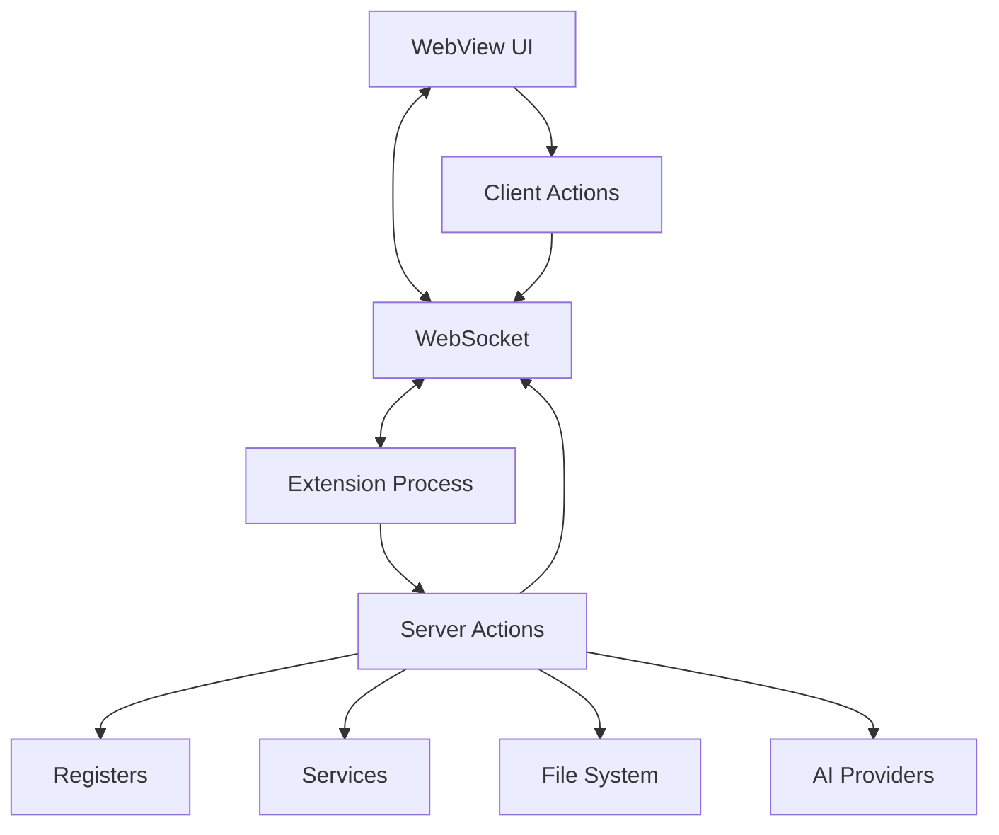

# Actions Module

## Module Overview

The Actions module is a critical part of the Aide VSCode extension that defines and implements a collection of server-side actions. These actions serve as the API layer that enables communication between the extension's user interface and its core functionality, providing a structured way to perform operations on various aspects of the system.

## Core Functionality

- **Action Collection System**: Organizes related actions into collection classes that extend `ServerActionCollection`
- **Command Execution**: Provides methods to execute commands with proper context and error handling
- **Resource Management**: Handles file operations, chat sessions, agent interactions, and settings management
- **State Synchronization**: Ensures consistent state between UI and backend components
- **Extension Feature Control**: Enables or disables extension features based on user configuration
- **Integration Point**: Acts as the bridge between UI components and backend services
- **Cross-Process Communication**: Facilitates communication between the extension backend (server) and UI (client) processes

## Key Components

### Collection Classes

Each file in this module exports a collection class that extends `ServerActionCollection` and provides a set of related actions:

- **AgentActionsCollection** (`agent-actions.ts`): Manages AI agents throughout their lifecycle, including starting, stopping, accepting, and rejecting agents. Provides methods for controlling multiple agent sessions and handling agent interactions.

- **AIModelActionsCollection** (`ai-model-actions.ts`): Manages AI models within the system, allowing for retrieval, creation, updating, and testing of models. Handles model feature detection and provides model settings for different extension features.

- **AIProviderActionsCollection** (`ai-provider-actions.ts`): Manages AI service providers, supporting operations like adding, updating, and removing providers. Ensures appropriate default provider and model selection.

- **ApplyActionsCollection** (`apply-actions.ts`): Manages code edit tasks, handling the creation, validation, acceptance, and rejection of code changes. Provides functionality for diffing, applying changes, and tracking edit history.

- **ChatActionsCollection** (`chat-actions.ts`): Handles chat functionality, including streaming conversations and prompt generation. Provides methods to process and respond to chat inputs.

- **ChatSessionActionsCollection** (`chat-session-actions.ts`): Manages chat sessions and their states, supporting creation, updating, and deleting of sessions. Handles session persistence and retrieval.

- **CodebaseActionsCollection** (`codebase-actions.ts`): Provides functionality for indexing and searching the codebase, including reindexing operations and status reporting. Essential for code-aware AI features.

- **DocActionsCollection** (`doc-actions.ts`): Handles documentation-related actions, including retrieval, generation, and management of documentation for various code elements.

- **FileActionsCollection** (`file-actions.ts`): Provides comprehensive file system operations, including reading, writing, traversing, and manipulating files and directories. Supports various encoding formats and filesystem schemes.

- **GitActionsCollection** (`git-actions.ts`): Manages Git operations, providing functionality for accessing Git repositories, branches, commits, and status information.

- **GitProjectActionsCollection** (`git-project-actions.ts`): Extends Git functionality with project-specific operations, supporting project initialization, cloning, and management.

- **InternalConfigActionsCollection** (`internal-config-actions.ts`): Handles internal configuration settings that control various aspects of the extension's behavior.

- **McpActionsCollection** (`mcp-actions.ts`): Manages the "Mission Control Panel" functionality, providing access to system monitoring, diagnostics, and control operations.

- **MentionActionsCollection** (`mention-actions.ts`): Implements the @-mentions functionality, allowing references to files, code elements, and other resources within chat contexts.

- **ProjectActionsCollection** (`project-actions.ts`): Manages project metadata, settings, and operations, providing functionality for working with different project types.

- **PromptSnippetActionsCollection** (`prompt-snippet-actions.ts`): Manages reusable prompt snippets, allowing users to create, edit, and use predefined prompts in chat interactions.

- **SettingsActionsCollection** (`settings-actions.ts`): Handles extension settings, providing methods to get, set, and validate user configuration options.

- **SystemActionsCollection** (`system-actions.ts`): Provides system-level operations, including extension status, version checking, and system information retrieval.

- **TerminalActionsCollection** (`terminal-actions.ts`): Manages terminal operations, allowing for command execution and terminal session management within the extension.

- **WebVMActionsCollection** (`webvm-actions.ts`): Provides functionality for the WebVM environment, supporting preview of web projects, file management, and VM lifecycle operations.

- **WorkspaceCheckpointActionsCollection** (`workspace-checkpoint-actions.ts`): Manages workspace checkpoint functionality, allowing users to create, restore, and manage snapshots of their workspace state.

### Index File

The `index.ts` file exports all action collections as a unified array, making them available throughout the extension:

```typescript
export const serverActionCollections = [
  ChatActionsCollection,
  CodebaseActionsCollection,
  FileActionsCollection
  // ... other collections
] as const satisfies (typeof ServerActionCollection)[]
```

## Action System Architecture

The actions system is built on a client-server architecture that enables seamless communication between the extension backend (VSCode extension process) and frontend (WebView UI):

### Server-Side (Extension Backend)

Server actions are defined in this module and each extends the `ServerActionCollection` class. These collections are registered with the `ActionRegister` and made available through a proxy system.

**Server Action Structure:**

- Each collection has a unique `categoryName` property
- Actions are methods of the collection class
- Actions receive an `ActionContext` object that includes parameters and an abort controller
- Server actions have access to the `registerManager` and `commandManager` for integration with other extension components

### Client-Side (WebView UI)

Client actions, defined in the webview layer, extend the `ClientActionCollection` class and provide UI-specific functionality like refreshing views or updating UI state.

### Cross-Process Communication

The action system uses a proxy mechanism to allow:

1. Server code to call client actions
2. Client code to call server actions

This is handled through WebSocket communication, with action calls serialized and sent between processes.

## Dependencies

This module interacts with several other modules within the extension:

- **Register System**: Uses various registers to access functionality providers
- **Command System**: Executes commands in response to actions
- **Entity Models**: Operates on entities like `Conversation`, `Agent`, and `ChatContext`
- **File System**: Interfaces with VSCode's file system API through a custom VFS layer
- **AI Providers**: Communicates with AI models and providers for agent functionality

External dependencies include:

- VSCode API: For editor integration
- immer: For immutable state updates
- i18next: For internationalization
- socket.io: For WebSocket communication between server and client

## Usage Examples

### Server-Side: Executing an Action (Extension)

In the extension (server) code, actions are executed using the `runAction` function from the `state` module:

```typescript
// Example of executing a server action from server code
import { runAction } from '@extension/state'

// Execute a server action
const fileContent = await runAction().server.file.readFile({
  actionParams: {
    schemeUri: 'workspace:/path/to/file.ts'
  }
})

// Execute a client action from server code
await runAction(registerManager).client.chat.refreshCurrentChatSession({
  actionParams: {},
  webviewId // Specify which WebView should handle the action
})
```

### Client-Side: Executing an Action (WebView)

In the WebView (client) code, actions are executed using the actions API:

```typescript
// Example of executing a server action from client code
import { signalToController } from '@shared/utils/common'
import { api } from '@webview/network/actions-api'

// React Query example for calling a server action
const { data } = useQuery({
  queryKey: ['read-file', schemeUri],
  queryFn: ({ signal }) =>
    api.actions().server.file.readFile({
      actionParams: { schemeUri },
      abortController: signalToController(signal)
    })
})

// Direct call example
const handleClick = async () => {
  await api.actions().server.file.writeFile({
    actionParams: {
      schemeUri: 'workspace:/path/to/file.ts',
      data: 'Updated content'
    }
  })
}
```

## Architecture Notes

The Actions module follows a consistent pattern across all collection classes:



Each action follows a similar structure:

1. Receives an `ActionContext` with parameters and an abort controller
2. Processes the request, potentially utilizing registers, services, or other components
3. Returns the result or updates the state

The action system uses a category-based naming convention (e.g., `file.readFile`, `chat.streamChat`), making it easy to organize and discover functionality. This architecture enables a clean separation between UI logic and core functionality, allowing for better testability and maintenance.

The bidirectional nature of the action system allows for flexible communication patterns:

- Server can call client: For UI updates and notifications
- Client can call server: For data operations and system functionality
- Both support streaming responses: For real-time updates and progress reporting
