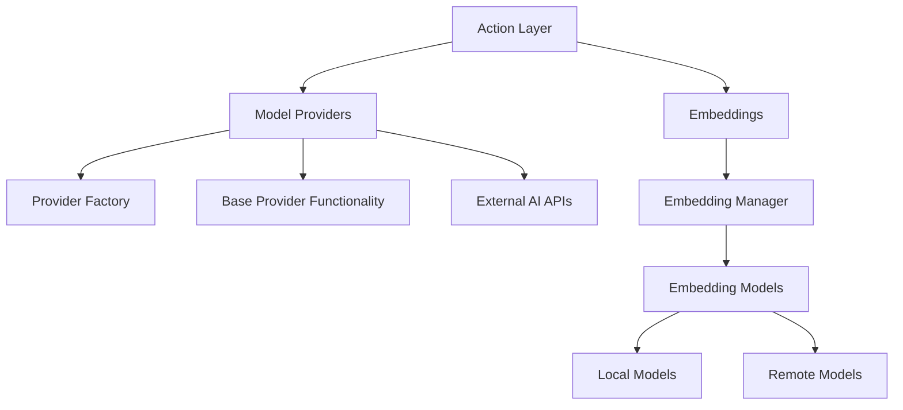

# AI Module

## Module Overview

The AI Module is a core component of the Aide VSCode extension that provides integration with various AI services and models. It manages the connections to different AI providers, handles model-specific operations, and provides embeddings functionality for semantic search and code understanding capabilities.

## Core Functionality

- **Model Provider Integration**: Provides uniform interfaces to multiple AI services (OpenAI, Anthropic, Azure, etc.)
- **Embeddings Generation**: Creates vector representations of code and text for semantic search and similarity matching
- **Feature Detection**: Tests AI models to determine their capabilities (chat support, tool calls, image handling, etc.)
- **Provider Management**: Manages credentials, API connections, and settings for different AI providers
- **Context-Aware Processing**: Analyzes code references and dependencies to provide relevant context for AI interactions
- **Usage Tracking**: Monitors API usage and provides information about quotas and limits

## Key Components

### Model Providers

The `model-providers/` directory contains implementations for various AI service providers:

- **base.ts**: Abstract base class that defines the common interface for all model providers
- **openai.ts**: Implementation for OpenAI API (GPT models)
- **anthropic.ts**: Implementation for Anthropic API (Claude models)
- **azure-openai.ts**: Implementation for Azure-hosted OpenAI models
- **vscodelm.ts**: Integration with VSCode's built-in language models
- **aide.ts**: Implementation for Aide's own AI services

The providers share a common interface but handle provider-specific authentication, rate limiting, and feature capabilities.

### Model Provider Helpers

The `model-providers/helpers/` directory contains supporting utilities:

- **factory.ts**: Factory class that creates appropriate model provider instances based on settings
- **feature-tester.ts**: Tests AI models to determine their capabilities (chat, tools, image handling)
- **base.ts**: Core functionality for model providers including runnable creation and history management
- **chat-history-manager.ts**: Manages conversation history for stateful chat interactions

### Embeddings

The `embeddings/` directory provides functionality for generating and managing vector embeddings:

- **embedding-manager.ts**: Singleton manager that provides access to embedding models
- **transformer-js-embeddings.ts**: Implementation for local transformer-based embeddings
- **types.ts**: Type definitions for the embeddings subsystem

### Utility Functions

- **get-reference-file-scheme-uris.ts**: Uses AI to identify related files and dependencies for the current code context
- **aide-key-request.ts**: Handles API key validation and usage statistics for Aide's services

## Dependencies

This module interacts with several other components:

- **LangChain**: Uses LangChain's abstractions for model interactions
- **Entity Models**: Uses AI provider and model entities defined in `@shared/entities`
- **Database**: Stores provider and model configurations in LowDB databases
- **File System**: Accesses workspace files for context and embeddings

External dependencies include:

- LangChain for model abstractions
- Transformer.js for local embeddings
- OpenAI and other provider SDKs

## Usage Examples

### Creating and Using a Model Provider

```typescript
import { ModelProviderFactory } from '@extension/ai/model-providers/helpers/factory'
import { FeatureModelSettingKey } from '@shared/entities'

// Get a model provider for a specific feature
const modelProvider = await ModelProviderFactory.getModelProvider(
  FeatureModelSettingKey.Chat
)

// Create a runnable for chat
const runnable = await modelProvider.createRunnable({
  useHistory: true
})

// Generate a response
const response = await runnable.invoke([
  {
    type: 'human',
    content: 'Explain this code: function add(a, b) { return a + b }'
  }
])
```

### Using Embeddings

```typescript
import { EmbeddingManager } from '@extension/ai/embeddings/embedding-manager'

// Get the embedding manager instance
const embeddingManager = EmbeddingManager.getInstance()

// Embed a query
const queryEmbedding = await embeddingManager.embedQuery(
  'How to implement a search function'
)

// Embed multiple documents
const documentEmbeddings = await embeddingManager.embedDocuments([
  'function search() { /* ... */ }',
  'class Searcher { /* ... */ }'
])
```

## Architecture Notes

The AI module follows a layered architecture:



The system uses a factory pattern to create the appropriate provider based on the current settings, and provider-specific implementations handle the details of communicating with each AI service. The embedding system supports both local (transformer.js) and remote (OpenAI) embedding models.

Model capabilities are dynamically tested to ensure that each provider is used only for the features it supports, with appropriate fallbacks when necessary. This architecture allows for easy addition of new AI providers and models while maintaining a consistent interface for the rest of the extension.
