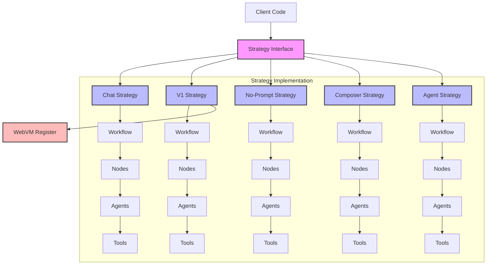

# Chat Strategies Module

## Module Overview

The Chat Strategies Module provides a comprehensive framework for implementing different AI-powered conversation workflows in the Aide VSCode extension. It defines a flexible architecture based on the strategy pattern, allowing for various conversation models and interaction patterns while maintaining a consistent interface for the rest of the application.

## Core Functionality

- **Strategy Pattern Implementation**: Provides multiple interchangeable conversation strategies with a unified interface
- **Workflow Management**: Orchestrates complex conversation workflows using directed graphs via LangGraph
- **Agent Integration**: Connects AI agents with VSCode capabilities through a standardized framework
- **State Management**: Handles conversation state throughout the interaction lifecycle
- **Message Construction**: Builds structured messages for AI models from conversation history
- **Tool Execution**: Processes and executes tools based on agent analysis to perform actions in the IDE

## Key Components

### Base Framework

- **\_base/**: Contains the foundational classes and interfaces that all strategies extend
  - **base-strategy.ts**: Abstract class defining the core strategy interface
  - **base-node.ts**: Framework for creating workflow nodes
  - **base-agent.ts**: Abstract class for implementing AI agents
  - **base-state.ts**: State management utilities for conversation workflows

### Strategy Implementations

- **chat-strategy/**: Implements a comprehensive natural language conversation workflow

  - Inspired by and designed to match the functionality of Cursor.sh's chat interface
  - Replicates Cursor's ability to understand codebases and answer questions about code
  - Supports tool execution, message generation, and state management
  - Provides a complete implementation of a chat conversation workflow using LangGraph
  - Implements features similar to Cursor's chat sidebar functionality

- **composer-strategy/**: Strategy focused on AI-assisted code editing and generation

  - Specialized for automatically applying AI-generated changes to files
  - Modeled after Cursor's composer functionality for code generation and editing
  - Streamlines the process of implementing AI suggestions directly into the codebase
  - Provides a more direct workflow for code modifications without requiring manual application
  - Enables efficient code generation and refactoring through natural language instructions

- **v1-strategy/**: Conversation strategy that recreates Vercel's v0.dev functionality

  - Integrates with the WebVM Register module to provide web application development capabilities
  - Enables AI-assisted creation and preview of web applications using various frontend frameworks
  - Leverages WebVM's project management, live preview, and framework preset systems
  - Recreates v0.dev's ability to generate UI components and web applications from natural language descriptions
  - Provides a specialized conversation flow optimized for web development tasks

- **no-prompt-strategy/**: Strategy for chat without any predefined system prompt

  - Operates without any preset system prompts or instructions
  - Provides a "blank slate" conversation experience with the AI model
  - Allows for more flexible and open-ended interactions
  - Useful for scenarios where default prompts might constrain the conversation
  - Enables users to define their own conversation context from scratch

- **agent-strategy/**: Agent-focused strategy for tool-driven interactions
  - Designed to match functionality similar to Cursor or Windsurf's agent mode
  - Aims to implement end-to-end task completion while keeping users in the loop
  - Emphasizes agent capabilities and tool execution
  - Framework in place but implementation is still in progress
  - Will support features like automatic command execution and error correction loops

## Dependencies

The Strategies Module has the following key dependencies:

- **LangGraph**: For building directed graphs of language processing components
- **LangChain**: Core components for working with language models and tools
- **Command Manager**: For registering and executing VSCode commands
- **Register Manager**: For accessing extension registers and services
- **Shared Entities**: Common types and interfaces used across the extension
- **WebVM Register**: For v1-strategy to create and manage web application projects

## Usage Examples

```typescript
// Using a specific strategy to get AI responses
import { ChatStrategy } from '@extension/chat/strategies/chat-strategy'
import { CommandManager } from '@extension/commands/command-manager'
import { RegisterManager } from '@extension/registers/register-manager'

export async function getAIResponse(
  context: vscode.ExtensionContext,
  chatContext: ChatContext,
  userMessage: string
) {
  const commandManager = new CommandManager(context)
  const registerManager = new RegisterManager(context, commandManager)

  // Initialize the chat strategy
  const chatStrategy = new ChatStrategy({
    registerManager,
    commandManager
  })

  // Update the chat context with the user message
  const updatedChatContext = {
    ...chatContext,
    conversations: [
      ...chatContext.conversations,
      {
        role: 'user',
        content: userMessage
      }
    ]
  }

  // Get AI responses
  const responseGenerator = chatStrategy.getAnswers(updatedChatContext)

  // Process responses as they are generated
  for await (const conversations of responseGenerator) {
    // The last conversation contains the AI response
    const aiResponse = conversations[conversations.length - 1]

    // Do something with the response
    console.log(aiResponse.content)
  }
}
```

## Architecture Notes

The Strategies Module follows a layered architecture with clear separation of concerns:



The system follows these key design principles:

1. **Strategy Pattern**: Different conversation strategies share a common interface but implement different behaviors
2. **Composition Over Inheritance**: While base classes provide structure, the system favors composition through nodes and tools
3. **Dependency Injection**: Components receive their dependencies through constructors and context objects
4. **State Immutability**: State is treated as immutable, with changes propagated through the graph
5. **Event-Based Communication**: Components communicate through a custom event system for real-time updates

The execution flow typically follows these steps:

1. A strategy is selected and initialized with necessary dependencies
2. The strategy creates a workflow of nodes using LangGraph
3. When executed, the workflow processes the conversation state through its nodes
4. Nodes execute agents and process their results
5. State changes are propagated through the graph and dispatched as events
6. UI components react to state changes and update accordingly

This architecture provides a flexible and extensible foundation for implementing various chat strategies while maintaining consistency and type safety throughout the system.
