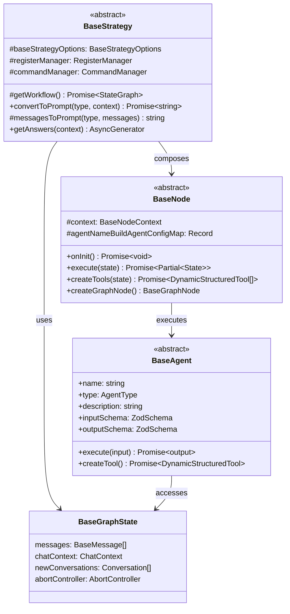

# Chat Strategies Base Module

## Module Overview

The Chat Strategies Base Module provides the foundational architecture for implementing AI-powered chat interactions in the Aide VSCode extension. It defines abstract classes, interfaces, and utilities that establish a consistent framework for building various chat strategies, managing conversation state, and integrating AI agents with the extension's capabilities.

## Core Functionality

- **Strategy Framework**: Abstract base classes for implementing different chat interaction strategies with consistent interfaces
- **State Management**: Robust state handling for chat conversations using LangGraph annotations and state propagation
- **Agent Integration**: Standardized framework for defining, registering, and executing AI agents within chat workflows
- **Node Architecture**: Composable node-based system for building complex chat processing workflows
- **Event Dispatching**: Streaming state updates to UI components through a custom event system
- **Type Safety**: Comprehensive TypeScript typing for all components ensuring type safety across the system

## Key Components

### Base Strategy

- **base-strategy.ts**: Defines the `BaseStrategy` abstract class that all chat strategies extend, providing core functionality for prompt conversion and workflow management
- **index.ts**: Exports key components for easy access by implementing strategies

### State Management

- **base-state.ts**: Implements the `BaseGraphState` type and related utilities for managing conversation state using LangGraph annotations
- **dispatchBaseGraphState**: Function for streaming state updates to UI components through custom events

### Agent Framework

- **base-agent.ts**: Defines the `BaseAgent` abstract class that all AI agents extend, providing a consistent interface for agent implementation
- **AgentContext**: Interface for providing context to agents during execution
- **GetAgentInput/Output**: Type utilities for inferring agent input and output types

### Node Architecture

- **base-node.ts**: Implements the `BaseNode` abstract class for creating workflow nodes that can execute agents and process their results
- **BaseNodeContext**: Interface for providing context to nodes during execution
- **createToolsFromNodes/createGraphNodeFromNodes**: Utility functions for creating tools and graph nodes from node classes

## Dependencies

The Base Module has the following key dependencies:

- **LangGraph**: For building directed graphs of language processing components
- **LangChain**: Core components for working with language models and tools
- **Zod**: Schema validation for agent inputs and outputs
- **VSCode API**: Integration with VSCode's extension APIs
- **Command Manager**: For registering and executing commands
- **Register Manager**: For accessing extension registers and services

## Usage Examples

```typescript
// Implementing a custom strategy
import { BaseGraphState } from '@extension/chat/strategies/_base/base-state'
import {
  BaseStrategy,
  ConvertToPromptType
} from '@extension/chat/strategies/_base/base-strategy'

export class CustomStrategy extends BaseStrategy<BaseGraphState> {
  protected async getWorkflow() {
    // Create and return a workflow using LangGraph
    const workflow = new StateGraph(baseGraphState)
      .addNode('agent', agentNode)
      .addNode('process', processNode)
      .addEdge('agent', 'process')

    return workflow
  }

  async convertToPrompt(
    type: ConvertToPromptType,
    context: ChatContext,
    abortController?: AbortController
  ): Promise<string> {
    // Convert the chat context to a prompt string
    const messages = await this.constructMessages(context)
    return this.messagesToPrompt(type, messages)
  }
}
```

```typescript
// Implementing a custom agent
import { BaseAgent } from '@extension/chat/strategies/_base/base-agent'
import { z } from 'zod'

export class CustomAgent extends BaseAgent<BaseGraphState, {}> {
  name = 'customAgent'
  type = 'normal'
  description = 'A custom agent for performing specific tasks'

  inputSchema = z.object({
    query: z.string().describe('The query to process')
  })

  outputSchema = z.object({
    result: z.string().describe('The processing result')
  })

  async execute(input: z.infer<typeof this.inputSchema>) {
    // Implement agent logic
    const result = await processQuery(input.query)
    return { result }
  }
}
```

## Architecture Notes

The Base Module follows a layered architecture with clear separation of concerns:



The system follows these key principles:

1. **Composition Over Inheritance**: While base classes provide structure, the system favors composition through nodes and tools
2. **Dependency Injection**: Components receive their dependencies through constructors and context objects
3. **State Immutability**: State is treated as immutable, with changes propagated through the graph
4. **Type Safety**: Extensive use of TypeScript generics and Zod schemas ensures type safety
5. **Event-Based Communication**: Components communicate through a custom event system for real-time updates

The execution flow typically follows these steps:

1. A strategy is initialized with necessary dependencies
2. The strategy creates a workflow of nodes using LangGraph
3. When executed, the workflow processes the conversation state through its nodes
4. Nodes execute agents and process their results
5. State changes are propagated through the graph and dispatched as events
6. UI components react to state changes and update accordingly

This architecture provides a flexible and extensible foundation for implementing various chat strategies while maintaining consistency and type safety throughout the system.
