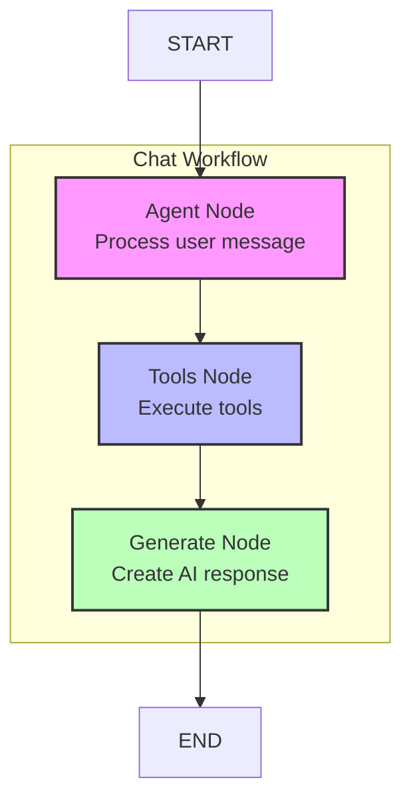
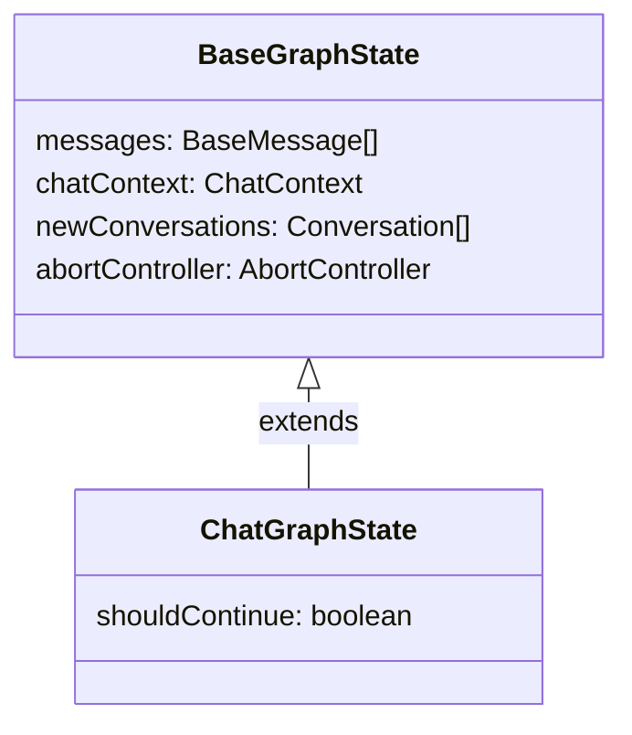

# Chat Strategy Module

## Module Overview

The Chat Strategy Module implements a comprehensive conversation workflow for AI-powered chat interactions in the Aide VSCode extension. Building on the base strategy framework, it provides a specific implementation focused on natural language conversations with AI models, supporting tool execution, message generation, and state management throughout the chat lifecycle.

## Core Functionality

- **Conversation Workflow**: Complete implementation of a chat conversation workflow using LangGraph
- **Agent Execution**: Processing of user messages through AI agents to understand intent and extract actions
- **Tool Integration**: Execution of tools based on agent analysis to perform actions in the IDE
- **Response Generation**: Creation of AI responses based on conversation context and tool results
- **State Management**: Specialized state handling for chat-specific conversation flows
- **Message Construction**: Building structured messages for AI models from conversation history

## Key Components

### Core Infrastructure

- **index.ts**: Exports the `ChatStrategy` class that extends `BaseStrategy` with chat-specific functionality
- **state.ts**: Defines the `ChatGraphState` type and related utilities for managing chat-specific state
- **chat-workflow.ts**: Creates the LangGraph workflow that orchestrates the chat conversation process

### Workflow Nodes

- **agent-node.ts**: Implements the `AgentNode` class that processes user messages through AI agents
- **generate-node.ts**: Implements the `GenerateNode` class that generates AI responses based on conversation context

### Message Construction

- **messages-constructors/**: Directory containing message construction utilities
- **chat-messages-constructor.ts**: Builds structured messages for AI models from conversation history

## Dependencies

The Chat Strategy Module has the following key dependencies:

- **Base Strategy Framework**: Core components from `@extension/chat/strategies/_base`
- **LangGraph**: For building the directed graph of the chat workflow
- **LangChain**: Core components for working with language models and tools
- **Server Plugin Register**: For accessing mention plugins and other server-side extensions
- **Chat Context Operator**: Utilities for manipulating chat context

## Usage Examples

```typescript
// Using the chat strategy to get AI responses
import { ChatStrategy } from '@extension/chat/strategies/chat-strategy'
import { CommandManager } from '@extension/commands/command-manager'
import { RegisterManager } from '@extension/registers/register-manager'

export async function getAIResponse(
  context: vscode.ExtensionContext,
  chatContext: ChatContext,
  userMessage: string
) {
  const commandManager = new CommandManager(context)
  const registerManager = new RegisterManager(context, commandManager)

  // Initialize the chat strategy
  const chatStrategy = new ChatStrategy({
    registerManager,
    commandManager
  })

  // Update the chat context with the user message
  const updatedChatContext = {
    ...chatContext,
    conversations: [
      ...chatContext.conversations,
      {
        role: 'user',
        content: userMessage
      }
    ]
  }

  // Get AI responses
  const responseGenerator = chatStrategy.getAnswers(updatedChatContext)

  // Process responses as they are generated
  for await (const conversations of responseGenerator) {
    // The last conversation contains the AI response
    const aiResponse = conversations[conversations.length - 1]

    // Do something with the response
    console.log(aiResponse.content)
  }
}
```

```typescript
// Converting a chat context to a prompt string
import { ChatStrategy } from '@extension/chat/strategies/chat-strategy'

export async function getChatPrompt(
  chatStrategy: ChatStrategy,
  chatContext: ChatContext
) {
  // Convert the chat context to a prompt string
  const prompt = await chatStrategy.convertToPrompt(
    'finalConversation',
    chatContext
  )

  return prompt
}
```

## Architecture Notes

The Chat Strategy Module implements a directed graph workflow for processing chat conversations:



The workflow follows these key steps:

1. **Agent Node**: Processes the user message through AI agents to understand intent and extract actions
2. **Tools Node**: Executes tools based on agent analysis to perform actions in the IDE
3. **Generate Node**: Creates AI responses based on conversation context and tool results

The chat strategy uses a specialized state type `ChatGraphState` that extends the base `BaseGraphState` with chat-specific properties:



The execution flow of the chat strategy follows these steps:

1. User sends a message which is added to the chat context
2. The chat strategy initializes the workflow with the updated context
3. The agent node processes the user message and identifies required tools
4. The tools node executes the identified tools
5. The generate node creates an AI response based on the results
6. The response is added to the conversation and returned to the user

This architecture enables a flexible and extensible chat system that can be enhanced with additional nodes and tools while maintaining a consistent conversation flow.
