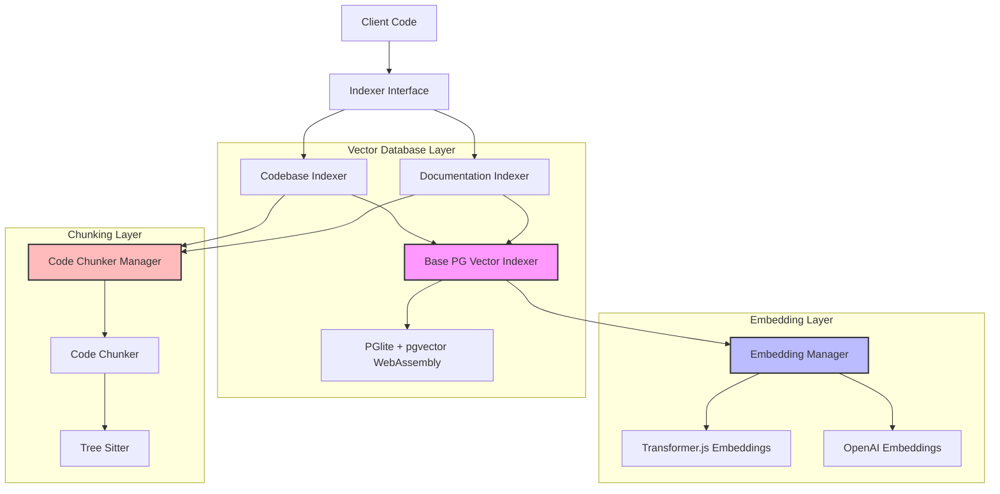

# Vector Database Module

## Module Overview

The Vector Database Module provides a robust framework for creating, managing, and querying vector embeddings of code and documentation in the Aide VSCode extension. It enables semantic search capabilities by converting text content into vector representations and storing them in a PGlite+pgvector WebAssembly-based database, allowing AI assistants to find and reference relevant code and documentation based on semantic similarity rather than just keyword matching.

## Core Functionality

- **Vector Embedding Storage**: Stores vector embeddings of code chunks and documentation in a PGlite+pgvector WebAssembly database
- **Semantic Search**: Enables finding code and documentation based on semantic similarity to queries
- **Incremental Indexing**: Supports both full and differential re-indexing of workspace files
- **Code Chunking Integration**: Works with the code chunker to break down code into semantically meaningful segments
- **Multi-Model Support**: Compatible with different embedding models through the embedding manager

## Key Components

### Base Infrastructure

- **base-pgvector-indexer.ts**: Abstract base class for vector database indexers
  - Provides core functionality for managing vector embeddings in a PGlite+pgvector database
  - Handles database initialization, querying, and index management
  - Implements file change tracking and incremental indexing
  - Manages concurrency and progress reporting during indexing operations

### Specialized Indexers

- **codebase-indexer.ts**: Specialized indexer for code files in the workspace

  - Indexes code files by chunking them into semantically meaningful segments
  - Integrates with the code chunker to extract code chunks based on language-specific parsing
  - Filters files based on extension and ignore patterns
  - Creates embeddings for code chunks with file path context

- **doc-indexer.ts**: Specialized indexer for documentation files
  - Indexes documentation files from specified documentation roots
  - Creates embeddings for documentation chunks
  - Enables semantic search across documentation content
  - Supports multiple documentation sources with separate tables

## Integration with Other Modules

### Embeddings Module

The Vector Database Module integrates closely with the Embeddings Module:

- **embedding-manager.ts**: Central manager for embedding models

  - Provides access to different embedding models (local and remote)
  - Handles model initialization and switching
  - Manages embedding generation for queries and documents

- **transformer-js-embeddings.ts**: Local embedding model implementation
  - Provides efficient embedding generation using Transformer.js
  - Runs locally without requiring external API calls
  - Supports batched embedding generation for efficiency

### Code Chunking

The module works with the Tree-Sitter based code chunking system:

- **code-chunker.ts**: Breaks down code files into meaningful chunks

  - Uses Tree-Sitter to parse code based on language-specific grammars
  - Extracts semantically meaningful code segments (functions, classes, etc.)
  - Ensures chunks stay within token limits for embedding models

- **constants.ts**: Defines supported file extensions and language mappings
  - Maps file extensions to Tree-Sitter language parsers
  - Determines which files can be processed by the code chunker

## Database Structure

The Vector Database Module uses PGlite with pgvector extension, a WebAssembly-based PostgreSQL-compatible database that runs entirely in-process:

- **Technology**:

  - **PGlite**: A lightweight WebAssembly implementation of PostgreSQL that runs in-process
  - **pgvector**: PostgreSQL extension for vector similarity search, compiled to WebAssembly
  - **Benefits**: No external database dependencies, runs entirely within the extension

- **Tables**: Creates tables with names based on embedding model and content type

  - `code_chunks_embeddings_[model_hash]`: Stores code chunk embeddings
  - `doc_chunks_embeddings_[model_hash]_[doc_source_hash]`: Stores documentation embeddings

- **Schema**: Each table includes the following columns:
  - `id`: Unique identifier for the embedding
  - `scheme_uri`: URI of the source file
  - `file_hash`: Hash of the file content for change detection
  - `start_line`, `start_character`, `end_line`, `end_character`: Position of the chunk in the file
  - `embedding`: Vector representation of the chunk content (using pgvector's vector type)

## Usage Examples

```typescript
// Creating and using a codebase indexer
import { EmbeddingManager } from '@extension/ai/embeddings/embedding-manager'
import { CodebaseIndexer } from '@extension/chat/vectordb/codebase-indexer'

async function setupCodebaseSearch() {
  // Initialize embedding manager
  const embeddingManager = EmbeddingManager.getInstance()
  await embeddingManager.setActiveModel({
    type: 'transformer-js',
    modelName: 'all-MiniLM-L6-v2',
    dimensions: 384,
    maxTokens: 512,
    batchSize: 512
  })

  // Create and initialize codebase indexer
  const dbPath = '/path/to/vector/database.db'
  const codebaseIndexer = new CodebaseIndexer(dbPath)
  await codebaseIndexer.initialize()

  // Index the workspace
  await codebaseIndexer.indexWorkspace()

  // Perform semantic search
  const query = 'How to handle authentication'
  const queryEmbedding = await embeddingManager.embedQuery(query)
  const results = await codebaseIndexer.searchSimilar(queryEmbedding)

  // Process search results
  for (const result of results) {
    const content = await codebaseIndexer.getRowFileContent(result)
    console.log(`File: ${result.schemeUri}`)
    console.log(`Lines: ${result.startLine}-${result.endLine}`)
    console.log(`Content: ${content}`)
  }
}
```

```typescript
// Handling file changes and re-indexing
import { CodebaseIndexer } from '@extension/chat/vectordb/codebase-indexer'

async function setupFileWatcher(indexer: CodebaseIndexer) {
  // Set up file system watcher
  const watcher = vscode.workspace.createFileSystemWatcher('**/*')

  // Handle file changes
  watcher.onDidChange(async uri => {
    await indexer.handleFileChange(uri.toString())
  })

  // Handle file deletions
  watcher.onDidDelete(async uri => {
    await indexer.handleFileDelete(uri.toString())
  })

  // Perform differential re-indexing
  async function performDiffReindex() {
    await indexer.reindexWorkspace('diff')
  }

  // Schedule periodic differential re-indexing
  setInterval(performDiffReindex, 3600000) // Every hour
}
```

## Architecture Notes

The Vector Database Module follows a layered architecture with clear separation of concerns:



The system follows these key design principles:

1. **Abstraction Layers**: Clear separation between database, embedding, and chunking concerns
2. **Inheritance Hierarchy**: Specialized indexers extend the base indexer with specific behaviors
3. **Singleton Pattern**: Managers (EmbeddingManager, CodeChunkerManager) use singleton pattern for global access
4. **Asynchronous Processing**: All operations are asynchronous with proper error handling
5. **Incremental Updates**: Support for both full and differential indexing to minimize processing
6. **WebAssembly Integration**: Uses WebAssembly-based database technology for portability and performance

The execution flow typically follows these steps:

1. Initialize the PGlite+pgvector WebAssembly database and embedding model
2. Chunk code or documentation files into semantically meaningful segments
3. Generate vector embeddings for each chunk
4. Store embeddings in the database with metadata
5. When searching, convert the query to an embedding and find similar vectors using pgvector's similarity search
6. Return the most semantically similar chunks with their file locations

This architecture provides a flexible and efficient foundation for semantic code search, enabling AI assistants to find and reference relevant code and documentation based on meaning rather than just keywords.
