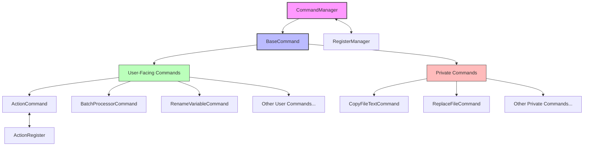

# Commands Module

## Module Overview

The Commands module is the central hub for managing and executing all commands within the Aide VSCode extension. It provides a robust framework for registering, accessing, and executing various command actions that enable users to interact with the extension's functionality through VS Code's command palette or keyboard shortcuts.

## Core Functionality

- **Command Registration**: Implements a standardized system for registering commands with VS Code and tracking them within the extension.
- **Command Execution**: Provides error-handled execution of commands with proper context and parameter passing.
- **Service Management**: Offers a registry for command-related services that can be accessed by command implementations.
- **Command Lifecycle**: Manages the creation, registration, and disposal of commands throughout the extension's lifecycle.
- **Extensible Framework**: Supplies a base class that all commands extend, ensuring consistent implementation and behavior.

## Key Components

### Core Framework

- **base.command.ts**: Defines the abstract `BaseCommand` class that all commands must extend, providing the foundation for command implementation with standard lifecycle methods.
- **command-manager.ts**: Implements the `CommandManager` class responsible for registering commands, managing their lifecycle, and providing access to shared services.
- **index.ts**: Entry point that exports the `registerCommands` function which registers all available commands with the command manager.

### User-Facing Commands

- **action/command.ts**: Provides a generic execution mechanism for various actions through a single command interface.
- **batch-processor/command.ts**: Enables batch processing operations across multiple files based on user-defined prompts.
- **code-convert/command.ts**: Facilitates conversion between different code formats or languages.
- **code-viewer-helper/command.ts**: Assists with viewing and navigating code.
- **copy-as-prompt/command.ts**: Allows copying code as AI prompts for various purposes.
- **expert-code-enhancer/command.ts**: Provides AI-powered code enhancement capabilities.
- **rename-variable/command.ts**: Offers AI-assisted variable renaming with contextual suggestions.
- **smart-paste/command.ts**: Implements intelligent pasting behavior with formatting adjustments.

### Private Internal Commands

- **private/copy-file-text.command.ts**: Internal command for copying file content.
- **private/open-webview.command.ts**: Handles opening extension webviews.
- **private/quick-close-file-without-save.command.ts**: Provides functionality to close files without saving.
- **private/replace-file.command.ts**: Manages file content replacement operations.
- **private/show-diff.command.ts**: Shows differences between file versions.

## Dependencies

### Internal Dependencies

- **@extension/logger**: Used for logging command registration and execution events.
- **@extension/registers**: Provides the register system that commands can interact with.
- **@extension/ai**: Supplies AI model providers for commands that utilize AI functionality.
- **@extension/utils**: Offers utility functions for command implementations.
- **@extension/file-utils**: Provides file system functionality used by various commands.

### External Dependencies

- **vscode**: Core VSCode API for command registration and UI interactions.
- **i18next**: Internationalization library for translating command messages.
- **p-limit**: Controls concurrency for commands that execute multiple operations.
- **zod**: Schema validation for structured AI outputs in certain commands.

## Usage Examples

### Registering Commands with VS Code

```typescript
// In your extension activation function
import { registerCommands } from './commands'
import { CommandManager } from './commands/command-manager'

export function activate(context: vscode.ExtensionContext) {
  // Create a command manager
  const commandManager = new CommandManager(context)

  // Register all commands with VS Code
  registerCommands(commandManager)

  // Later access commands as needed
  const actionCommand = commandManager.getCommand(ActionCommand)
}
```

### Implementing a Custom Command

```typescript
import * as vscode from 'vscode'

import { BaseCommand } from '../base.command'

export class MyCustomCommand extends BaseCommand {
  // Define the command ID for VS Code registration
  get commandName(): string {
    return 'aide.myCustomCommand'
  }

  // Implement the command execution logic
  async run(uri: vscode.Uri): Promise<void> {
    // Command implementation here
    const editor = vscode.window.activeTextEditor
    if (!editor) return

    // Access other services or commands if needed
    const someService =
      this.commandManager.getService<SomeService>('someService')

    // Perform command actions
    await vscode.window.showInformationMessage('Custom command executed!')
  }
}
```

## Architecture Notes

The Commands module follows a class-based architecture with dependency injection. Each command is implemented as a class that extends the `BaseCommand` abstract class, providing consistent behavior and lifecycle management.



The command registration flow works as follows:

1. The `registerCommands` function is called during extension activation
2. Each command class is instantiated with the extension context and command manager
3. Commands register themselves with VS Code through the `register` method
4. VS Code invokes the command's `run` method when triggered by the user
5. Commands can access services and other commands through the `commandManager`

This architecture enables a clean separation of concerns, with each command responsible for its specific functionality while sharing common infrastructure through the command manager.
