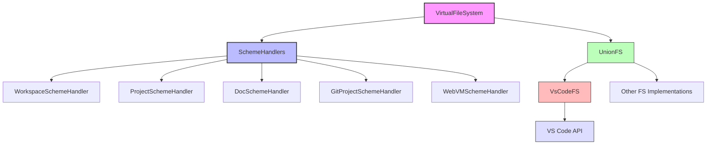

# Virtual File System (VFS) Module

## Module Overview

The Virtual File System (VFS) module provides a unified and extensible abstraction layer for file operations within the Aide VSCode extension. It enables seamless interaction with various file sources through URI schemes, abstracting away the complexities of different file system implementations while maintaining a consistent Node.js-compatible interface.

## Core Functionality

- **Unified File Access**: Provides a consistent interface for accessing files from different sources (workspace, project, git, documents, etc.) using scheme-based URIs.
- **URI Scheme Management**: Implements a system of URI schemes (workspace://, project://, etc.) that abstract file locations and enable transparent file operations.
- **VS Code File System Integration**: Wraps VS Code's file system API with Node.js fs-compatible interfaces, allowing for consistent file operations.
- **Path Resolution**: Offers robust utilities for resolving between scheme URIs and file system paths in various formats (relative, full, base).
- **Extended File Operations**: Includes additional utility functions beyond standard Node.js fs operations, such as ensuring files/directories exist and handling JSON files.

## Key Components

### Core Framework

- **index.ts**: Implements the `VirtualFileSystem` class, which serves as the main entry point and orchestrates file operations across different schemes.
- **helpers/utils.ts**: Defines fundamental types and base classes for scheme handlers, including the abstract `BaseSchemeHandler` class.
- **helpers/types.ts**: Contains type definitions for URI schemes and other common types used throughout the module.

### Scheme Handlers

- **schemes/workspace-scheme.ts**: Handles workspace:// URIs, mapping to the current VS Code workspace.
- **schemes/project-scheme.ts**: Manages project:// URIs, for accessing specific projects.
- **schemes/git-project-scheme.ts**: Provides access to git projects through git-project:// URIs.
- **schemes/doc-scheme.ts**: Enables operations on open documents via doc:// URIs.
- **schemes/webvm-scheme.ts**: Supports webvm:// URIs for browser-based virtual machine access.

### VS Code FS Integration

- **vscode-fs/index.ts**: Core implementation of the VS Code file system adapter that maps to Node.js fs-compatible interfaces.
- **vscode-fs/read-file.ts**: Implements file reading operations using VS Code's file system API.
- **vscode-fs/write-file.ts**: Provides file writing functionality through VS Code's file system.
- **vscode-fs/readdir.ts**: Implements directory listing operations.
- **vscode-fs/watch.ts**: Provides file and directory watching capabilities.
- **vscode-fs/lstat.ts**: Implements file stat information retrieval.
- **vscode-fs/\_helpers.ts**: Contains utility functions shared across VS Code file system operations.

### Extended File Utilities

- **helpers/fs-extra/ensure-file.ts**: Ensures a file exists, creating it and its parent directories if needed.
- **helpers/fs-extra/ensure-dir.ts**: Guarantees that a directory exists, creating it and its parent directories if necessary.

## Dependencies

### Internal Dependencies

- **@extension/logger**: Used for logging file operations and errors.
- **@extension/utils**: Provides general utilities such as getting the current workspace folder.
- **@shared/utils/common**: Offers common utility functions used across the codebase.
- **@shared/utils/scheme-uri-helper**: Provides utilities for working with scheme URIs.

### External Dependencies

- **unionfs**: Enables combining multiple file systems into a single unified interface.
- **vscode**: The VS Code extension API for accessing VS Code's file system.
- **comment-json**: Used for parsing and stringifying JSON with comments.
- **i18next**: Provides internationalization support for error messages and other text.

## Usage Examples

### Working with Scheme URIs

```typescript
// Import the virtual file system instance
import { vfs } from '@extension/file-utils/vfs'
import { workspaceSchemeHandler } from '@extension/file-utils/vfs/schemes/workspace-scheme'

// Create a workspace scheme URI for a file in the current workspace
const schemeUri = workspaceSchemeHandler.createSchemeUri({
  relativePath: 'src/extension/example.ts'
})

// Read a file using the scheme URI
const fileContent = await vfs.readFilePro(schemeUri)

// Write to a file using the scheme URI
await vfs.writeFilePro(schemeUri, 'Updated content')

// Get the full file system path from a scheme URI
const fullPath = await vfs.resolveFullPathProAsync(schemeUri, false)
```

### Creating Custom Scheme Handlers

```typescript
import { UriScheme } from '@extension/file-utils/vfs/helpers/types'
import { BaseSchemeHandler } from '@extension/file-utils/vfs/helpers/utils'
import { SchemeUriHelper } from '@shared/utils/scheme-uri-helper'

// Define a custom scheme handler
export class CustomSchemeHandler extends BaseSchemeHandler {
  constructor() {
    super('custom' as UriScheme)
  }

  resolveBaseUriSync(uri: string): string {
    return SchemeUriHelper.create(this.scheme, '')
  }

  async resolveBaseUriAsync(uri: string): Promise<string> {
    return this.resolveBaseUriSync(uri)
  }

  resolveBasePathSync(uri: string): string {
    return '/custom/base/path'
  }

  async resolveBasePathAsync(uri: string): Promise<string> {
    return this.resolveBasePathSync(uri)
  }

  resolveRelativePathSync(uri: string): string {
    const uriHelper = new SchemeUriHelper(uri)
    return uriHelper.getPath() || './'
  }

  async resolveRelativePathAsync(uri: string): Promise<string> {
    return this.resolveRelativePathSync(uri)
  }

  resolveFullPathSync(uri: string): string {
    const basePath = this.resolveBasePathSync(uri)
    const relativePath = this.resolveRelativePathSync(uri)
    return SchemeUriHelper.join(basePath, relativePath)
  }

  async resolveFullPathAsync(uri: string): Promise<string> {
    return this.resolveFullPathSync(uri)
  }

  createSchemeUri(props: { relativePath?: string; fullPath?: string }): string {
    if (props.relativePath) {
      return SchemeUriHelper.create(this.scheme, props.relativePath)
    }
    // Additional implementation for fullPath...
    return ''
  }
}

// Register the custom handler with VFS
const customHandler = new CustomSchemeHandler()
vfs.registerSchemeHandler(customHandler)
```

## Architecture Notes

The VFS module follows a layered architecture pattern with a clear separation of concerns:



The architecture works as follows:

1. The `VirtualFileSystem` class is the central component that receives all file operation requests.
2. It delegates to appropriate scheme handlers based on URI pattern recognition.
3. Scheme handlers resolve the URI to an actual file system path.
4. The operation is then performed using the appropriate file system implementation (VsCodeFS or others).
5. The UnionFS library allows for combining multiple file system implementations.

This modular design allows for:

- Adding new scheme handlers without modifying the core system
- Supporting different file system backends transparently
- Maintaining compatibility with Node.js fs interfaces for consistent development experience
- Isolating implementation details of each file system type
