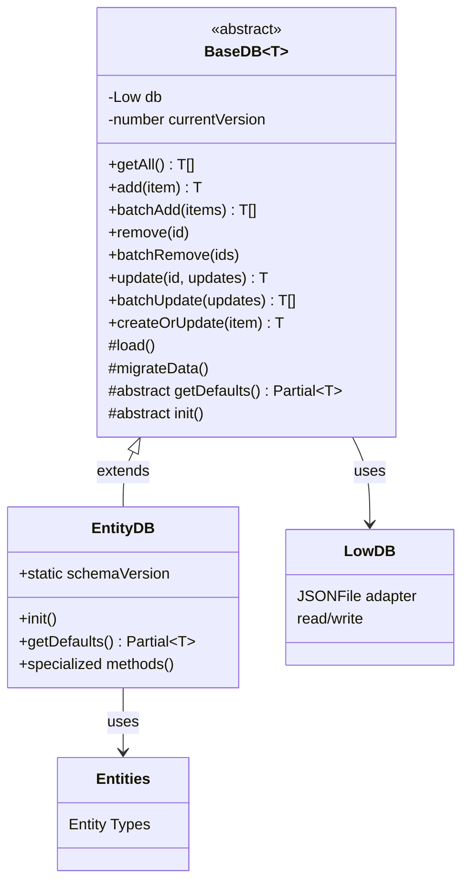

# LowDB Module

## Module Overview

The LowDB module provides a lightweight persistence layer for the Aide VSCode extension, managing the storage and retrieval of application entities using the LowDB JSON-based database. It serves as the data access layer that bridges the entity models with their persistent storage.

## Core Functionality

- **Entity Persistence**: Standardized methods for saving, loading, and querying entity data
- **Database Management**: Encapsulation of database connection and file operations
- **CRUD Operations**: Complete create, read, update, and delete functionality for all entity types
- **Data Isolation**: Separate database instances for different entity collections
- **Transaction Safety**: Atomic write operations to prevent data corruption
- **Schema Migration**: Support for evolving data structures while maintaining backward compatibility

## Key Components

### Base Infrastructure

- **\_base.ts**: Implements the abstract `BaseDB<T>` class that provides common database operations and schema versioning

### Entity-Specific Database Services

- **ai-model-db.ts**: Manages persistence for AI model configurations
- **ai-provider-db.ts**: Handles AI provider credentials and settings
- **chat-sessions-db.ts**: Stores chat session metadata
- **doc-sites-db.ts**: Manages documentation site information
- **git-project-db.ts**: Persists Git repository metadata
- **internal-config-db.ts**: Stores internal application configuration
- **mcp-db.ts**: Manages Model Context Protocol configurations
- **project-db.ts**: Handles project metadata storage
- **prompt-snippets-db.ts**: Stores reusable prompt snippets (both global and workspace-specific)
- **settings-db.ts**: Manages application settings and preferences (both global and workspace-specific)

### Module Integration

- **index.ts**: Exports all database instances as a unified collection via `dbList` constant

## Dependencies

The LowDB module has the following key dependencies:

- **lowdb**: The underlying JSON database library for data persistence
- **uuid**: Used for generating unique identifiers for new entities
- **Entities Module**: Uses the entity types and models defined in the shared/entities module
- **i18next**: For internationalization and entity initialization
- **Path Module**: For managing file paths to database storage locations

## Usage Examples

```typescript
// Accessing and using a specific database service
import { aiModelDB } from '@extension/lowdb'
import { AIModelEntity } from '@shared/entities'
import { t } from 'i18next'

// Create a new AI model entity
const newModel = new AIModelEntity(t, {
  name: 'GPT-4',
  providerOrBaseUrl: 'openai',
  chatSupport: true,
  imageInputSupport: true,
  imageOutputSupport: false,
  audioInputSupport: false,
  audioOutputSupport: false,
  toolsCallSupport: true
})

// Save the entity to the database
await aiModelDB.add(newModel.entity)

// Query all models
const allModels = await aiModelDB.getAll()
console.log(`Found ${allModels.length} AI models`)

// Update a model
const modelToUpdate = allModels[0]
await aiModelDB.update(modelToUpdate.id, { name: 'Updated Model Name' })

// Delete a model
await aiModelDB.remove(modelToUpdate.id)
```

```typescript
// Using different database scopes (global vs workspace)
// Search for specific chat sessions
import {
  chatSessionsDB,
  promptSnippetsGlobalDB,
  promptSnippetsWorkspaceDB
} from '@extension/lowdb'

// Get all global prompt snippets
const globalSnippets = await promptSnippetsGlobalDB.getAll()

// Get all workspace-specific prompt snippets
const workspaceSnippets = await promptSnippetsWorkspaceDB.getAll()

const matchingSessions = await chatSessionsDB.search('meeting notes')
```

## Architecture Notes

The LowDB module follows a consistent architecture pattern for database operations:



Each specific database class extends the `BaseDB<T>` abstract class, inheriting common CRUD operations while implementing the required abstract methods:

1. `init()`: Sets up the database file path and schema version
2. `getDefaults()`: Provides default values for entity creation

The module follows a singleton pattern, with each database class exporting a single instance (e.g., `aiModelDB`, `chatSessionsDB`). Some entity types have both global and workspace-specific databases (e.g., `promptSnippetsGlobalDB` and `promptSnippetsWorkspaceDB`).

The database files are stored either globally or at the workspace level, allowing for both application-wide and project-specific data storage. Schema versioning is built in, with the ability to migrate data when schema versions change.
