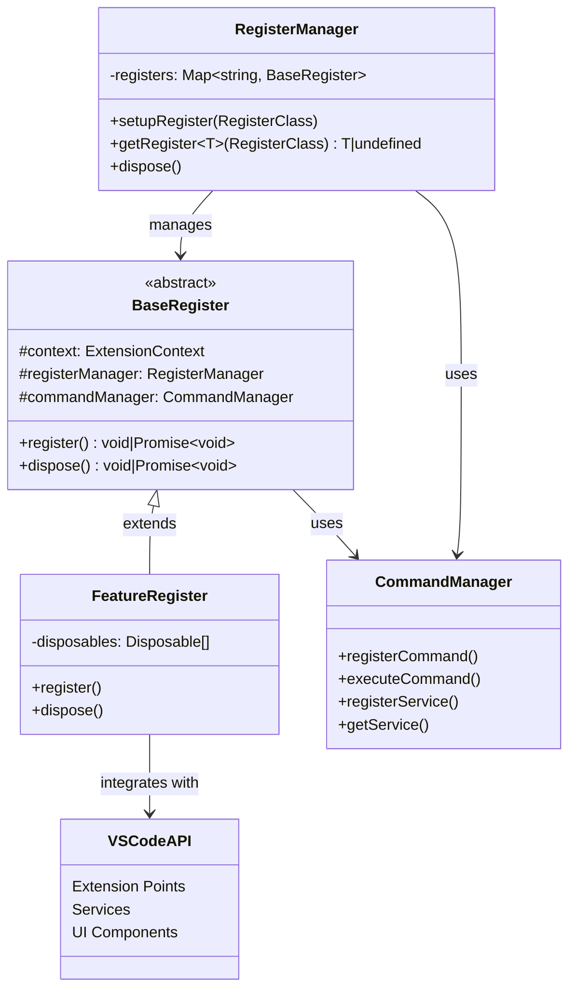

# Registers Module

## Module Overview

The Registers Module serves as the core initialization and lifecycle management system for the Aide VSCode extension. It provides a structured framework for registering, initializing, and disposing of various extension components, ensuring proper dependency management and resource cleanup throughout the extension's lifecycle.

## Core Functionality

- **Component Registration**: Standardized mechanism for initializing and registering extension components
- **Lifecycle Management**: Coordinated startup and shutdown sequences for all extension subsystems
- **Dependency Injection**: Centralized access to shared services and resources across the extension
- **Resource Cleanup**: Systematic disposal of resources when components are no longer needed
- **Extension Point Management**: Integration with VSCode's extension points (views, commands, etc.)
- **Service Discovery**: Registry pattern implementation allowing components to discover and interact with each other

## Key Components

### Core Infrastructure

- **base-register.ts**: Defines the abstract `BaseRegister` class that all register implementations extend
- **register-manager.ts**: Manages the registration and lifecycle of all register components
- **index.ts**: Orchestrates the initialization sequence of all registers in the correct order

### Register Components

#### Webview Register

Provides the core infrastructure for creating, managing, and communicating with webview-based user interfaces in the extension. It serves as the bridge between the extension's backend services and the frontend React application, handling webview lifecycle, state synchronization, and message passing.

#### Code Edit Register

Manages AI-assisted code editing operations, handling the lifecycle of code edit tasks from creation through generation, review, and application or rejection of changes. It provides diff visualization, streaming updates, and robust state management for code editing operations.

#### Workspace Checkpoint Register

Creates, manages, and restores checkpoints of the workspace file system, enabling safe experimentation with AI-generated code changes. It utilizes Git's version control capabilities for efficient state management, allowing users to easily revert to previous states.

#### MCP Register

Provides integration with the Model Context Protocol, enabling communication with various AI models and tools through a standardized protocol. It manages connections to MCP providers, handles resource discovery, and facilitates tool execution with support for multiple transport mechanisms.

#### WebVM Register

Provides a virtual machine environment for web application development and preview within the extension. It enables AI-assisted creation, management, and real-time preview of web applications using various frontend frameworks through a preset system.

#### Chat Histories Tree Register

Implements the chat history tree view in the sidebar, allowing users to browse and manage their conversation history with AI assistants.

#### Prompt Snippet Tree Register

Manages the prompt snippets tree view in the sidebar, providing access to reusable prompt templates for AI interactions.

#### Action Register

Registers and manages actions that can be executed by the extension, providing a unified interface for triggering functionality across the system.

#### Server Plugin Register

Manages server-side plugins for the extension, enabling extensibility through custom server components.

#### Terminal Watcher Register

Monitors terminal activity for integration with AI features, capturing terminal output for context in AI interactions.

#### DB Register

Initializes and manages database connections, providing data persistence services to the extension.

#### Model Register

Registers AI models and their configurations, making them available for use throughout the extension.

#### Codebase Watcher Register

Watches for changes in the codebase for indexing, maintaining up-to-date information about the workspace for AI context.

#### Temporary File Registers

Includes `tmp-file-schema-register` and `tmp-file-action-register` for handling temporary file operations during AI-assisted coding tasks.

## Dependencies

The Registers Module has the following key dependencies:

- **VSCode API**: Extensive use of VSCode extension points and APIs
- **Command Manager**: For registering and executing commands
- **LowDB Module**: For persistent storage of extension state
- **Shared Entities**: Entity models used across the extension
- **Logger**: For diagnostic and error logging
- **i18next**: For internationalization support

## Usage Examples

```typescript
// Setting up registers during extension activation
import { RegisterManager } from '@extension/registers/register-manager'
import { setupRegisters } from '@extension/registers'
import { CommandManager } from '@extension/commands/command-manager'

export async function activate(context: vscode.ExtensionContext) {
  // Create command and register managers
  const commandManager = new CommandManager(context)
  const registerManager = new RegisterManager(context, commandManager)

  // Initialize all registers
  await setupRegisters(registerManager)

  // Access a specific register
  const codeEditRegister = registerManager.getRegister(CodeEditRegister)
  if (codeEditRegister) {
    // Use the register's functionality
    await codeEditRegister.codeEditProvider.createTask(...)
  }
}
```

```typescript
// Creating a custom register
import { BaseRegister } from '@extension/registers/base-register'

export class CustomFeatureRegister extends BaseRegister {
  private disposables: vscode.Disposable[] = []

  async register(): Promise<void> {
    // Initialize your feature
    const myProvider = new MyCustomProvider()

    // Register with VSCode
    this.disposables.push(
      vscode.window.registerTreeDataProvider('myCustomView', myProvider)
    )

    // Make the provider available to other components
    this.registerManager.commandManager.registerService(
      'MyCustomProvider',
      myProvider
    )
  }

  dispose(): void {
    // Clean up resources
    this.disposables.forEach(d => d.dispose())
    this.disposables = []
  }
}
```

## Architecture Notes

The Registers Module follows a consistent architectural pattern:



The register system follows these key principles:

1. **Separation of Concerns**: Each register is responsible for a specific feature or subsystem
2. **Dependency Injection**: Common services are injected into registers via constructor
3. **Resource Management**: All registers implement proper cleanup in their `dispose()` method
4. **Lifecycle Hooks**: The `register()` method serves as the initialization hook
5. **Service Registry**: The command manager doubles as a service registry for cross-register communication

The initialization sequence in `index.ts` ensures that registers are initialized in the correct order, with dependencies being registered before the components that depend on them. This creates a predictable startup sequence and helps manage the complexity of the extension's initialization process.
