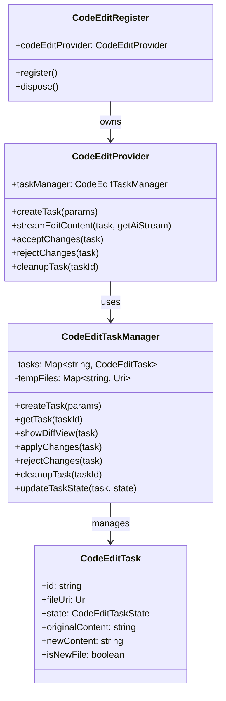

# Code Edit Register Module

## Module Overview

The Code Edit Register module provides a structured framework for managing AI-assisted code editing operations within the Aide VSCode extension. It handles the lifecycle of code edit tasks, from creation through generation, review, and application or rejection of changes.

## Core Functionality

- **Task Management**: Comprehensive tracking of code edit tasks throughout their lifecycle
- **Diff Visualization**: Side-by-side comparison of original and AI-generated code changes
- **Streaming Updates**: Real-time streaming of AI-generated code edits with visual feedback
- **File Operations**: Support for both modifying existing files and creating new files
- **State Management**: Robust state transitions for edit tasks (initial, generating, review, accepted, rejected)
- **Error Handling**: Graceful handling of errors during the code editing process

## Key Components

### Core Classes

- **code-edit-provider.ts**: Main entry point that exposes code editing capabilities to the rest of the extension

  - Manages the creation and lifecycle of code edit tasks
  - Handles streaming of AI-generated content
  - Provides methods for accepting or rejecting changes

- **task-manager.ts**: Manages the lifecycle of code edit tasks

  - Creates and tracks code edit tasks
  - Handles file operations (creating temp files, applying changes)
  - Manages diff views for comparing original and modified code
  - Handles cleanup of resources when tasks are completed

- **task-entity.ts**: Defines the structure and behavior of code edit task entities

  - Implements the entity pattern for code edit tasks
  - Provides serialization and deserialization of task data

- **types.ts**: Type definitions for the code edit module
  - Defines the `CodeEditTask` interface and related types
  - Defines the `CodeEditTaskState` enum for task state management
  - Provides type definitions for task creation parameters

### Key Interfaces

- **CodeEditTask**: Represents a code editing operation

  - Contains file information (URI, selection range)
  - Tracks original and new content
  - Maintains task state and metadata

- **CodeEditProvider**: Main service interface for code editing operations
  - Creates and manages code edit tasks
  - Streams AI-generated content
  - Handles accepting or rejecting changes

## Dependencies

The Code Edit Register module has the following key dependencies:

- **VSCode API**: For file operations, diff views, and UI integration
- **AI Model Providers**: For generating code edits
- **File Utils**: For temporary file creation and management
- **EventEmitter3**: For event-based communication
- **i18next**: For internationalization support

## Usage Examples

```typescript
// Creating and using a code edit task
import { CodeEditRegister } from '@extension/registers/code-edit-register'
import * as vscode from 'vscode'

// Get the code edit provider from the register
const codeEditRegister = registerManager.getRegister(CodeEditRegister)
const codeEditProvider = codeEditRegister.codeEditProvider

// Create a new code edit task
const task = await codeEditProvider.createTask({
  sessionId: 'session-123',
  conversationId: 'conv-456',
  agentId: 'agent-789',
  fileUri: vscode.Uri.file('/path/to/file.ts'),
  selection: new vscode.Range(0, 0, 10, 0),
  isNewFile: false,
  newContent: ''
})

// Stream AI-generated content
for await (const updatedTask of codeEditProvider.streamEditContent(
  task,
  abortController => getAIStream(abortController)
)) {
  // Handle task updates (e.g., update UI)
  console.log(`Task state: ${updatedTask.state}`)
}

// Accept the changes
await codeEditProvider.acceptChanges(task)

// Or reject the changes
// await codeEditProvider.rejectChanges(task)

// Clean up when done
await codeEditProvider.cleanupTask(task.id)
```

```typescript
// Creating a new file with AI-generated content
const newFileTask = await codeEditProvider.createTask({
  sessionId: 'session-123',
  conversationId: 'conv-456',
  agentId: 'agent-789',
  fileUri: vscode.Uri.file('/path/to/new-file.ts'),
  selection: new vscode.Range(0, 0, 0, 0),
  isNewFile: true,
  newContent:
    '// AI-generated content for new file\nconsole.log("Hello world");'
})

// Show diff view and wait for user review
for await (const updatedTask of codeEditProvider.streamEditContent(
  newFileTask,
  async () => {
    // For new files with predefined content, we can return a simple stream
    return createSimpleStream(newFileTask.newContent)
  }
)) {
  // Monitor task state changes
}

// Accept and create the new file
await codeEditProvider.acceptChanges(newFileTask)
```

## Architecture Notes

The Code Edit Register module follows a layered architecture pattern:



The module implements a state machine pattern for task lifecycle management:

1. **Initial**: Task is created with basic parameters
2. **Generating**: AI is generating content for the task
3. **WaitingForReview**: Content generation is complete, waiting for user review
4. **Accepted**: User has accepted the changes, which are applied to the target file
5. **Rejected**: User has rejected the changes, and the task is cleaned up
6. **Error**: An error occurred during the task lifecycle

The streaming architecture allows for real-time updates as AI generates content, providing immediate visual feedback to users through the diff view. This creates a responsive and interactive code editing experience that combines AI capabilities with user control.
