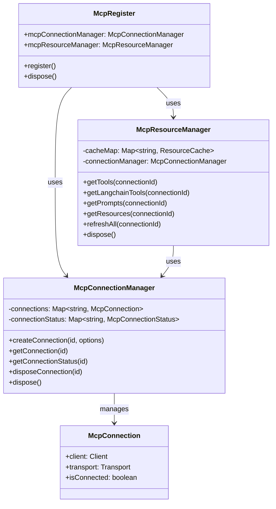

# MCP Register Module

## Module Overview

The MCP (Model Context Protocol) Register module provides integration with the Model Context Protocol, enabling the Aide VSCode extension to communicate with various AI models and tools through a standardized protocol. It manages connections to MCP providers, handles resource discovery, and facilitates tool execution.

## Core Functionality

- **Connection Management**: Establishes and maintains connections to MCP providers
- **Resource Discovery**: Discovers and caches available tools, prompts, and resources from MCP providers
- **Tool Integration**: Converts MCP tools to LangChain-compatible tools for use in the extension
- **Transport Abstraction**: Supports multiple transport mechanisms (WebSocket, SSE, stdio) for MCP communication
- **Caching**: Efficient caching of MCP resources to minimize network requests
- **Error Handling**: Robust error handling and connection state management

## Key Components

### Core Classes

- **mcp-register.ts**: Main entry point for MCP registration

  - Initializes the MCP subsystem
  - Connects to configured MCP providers
  - Manages the lifecycle of MCP connections

- **mcp-connection-manager.ts**: Manages connections to MCP providers

  - Creates and maintains MCP client connections
  - Tracks connection status and handles reconnection
  - Provides singleton access to connection instances
  - Handles connection lifecycle (creation, disposal)

- **mcp-resource-manager.ts**: Manages MCP resources

  - Discovers and caches tools, prompts, and resources
  - Converts MCP tools to LangChain tools
  - Provides methods for refreshing and accessing resources
  - Implements efficient caching strategies

- **mcp-tool-utils.ts**: Utilities for working with MCP tools
  - Creates appropriate transport instances based on configuration
  - Converts MCP tools to LangChain-compatible tools
  - Handles tool schema conversion and execution

### Key Interfaces

- **McpConnection**: Represents a connection to an MCP provider

  - Contains client, transport, and connection state
  - Provides methods for interacting with the MCP provider

- **McpConnectionStatus**: Tracks the status of an MCP connection

  - Monitors connection state (connected, disconnected, error)
  - Records connection timestamps and error information

- **ResourceCache**: Caches resources from MCP providers
  - Stores tools, prompts, resources, and resource templates
  - Reduces network overhead for frequently accessed resources

## Dependencies

The MCP Register module has the following key dependencies:

- **Model Context Protocol SDK**: Core SDK for MCP communication
- **LangChain Core**: For tool integration and execution
- **LowDB Module**: For persistent storage of MCP configurations
- **JSON Schema to Zod**: For converting tool schemas to Zod validators
- **i18next**: For internationalization support

## Usage Examples

```typescript
// Connecting to an MCP provider
import { mcpDB } from '@extension/lowdb/mcp-db'
import { McpRegister } from '@extension/registers/mcp-register/mcp-register'

// Get the MCP connection manager from the register
const mcpRegister = registerManager.getRegister(McpRegister)
const connectionManager = mcpRegister.mcpConnectionManager

// Create a connection to an MCP provider
const connection = await connectionManager.createConnection('my-provider', {
  type: 'websocket',
  url: 'ws://localhost:8000'
})

// Check connection status
const status = connectionManager.getConnectionStatus('my-provider')
console.log(`Connection status: ${status.state}`)

// Dispose of a connection when no longer needed
await connectionManager.disposeConnection('my-provider')
```

```typescript
// Discovering and using MCP tools
import { McpRegister } from '@extension/registers/mcp-register/mcp-register'

// Get the MCP resource manager from the register
const mcpRegister = registerManager.getRegister(McpRegister)
const resourceManager = mcpRegister.mcpResourceManager

// Get available tools from an MCP provider
const tools = await resourceManager.getTools('my-provider')
console.log(`Available tools: ${tools.tools.map(t => t.name).join(', ')}`)

// Convert MCP tools to LangChain tools
const langchainTools = await resourceManager.getLangchainTools('my-provider')

// Use a LangChain tool
const result = await langchainTools[0].invoke({
  input: 'Hello, world!'
})
console.log(`Tool result: ${result}`)

// Refresh the tools cache
await resourceManager.refreshTools('my-provider')
```

## Architecture Notes

The MCP Register module follows a manager-based architecture pattern:



The module implements several key architectural patterns:

1. **Singleton Pattern**: Both `McpConnectionManager` and `McpResourceManager` are implemented as singletons
2. **Factory Pattern**: Methods like `createTransport` and `createLangchainTool` act as factories
3. **Proxy Pattern**: The MCP client acts as a proxy to remote MCP providers
4. **Cache Pattern**: Resource caching is implemented to optimize performance
5. **Strategy Pattern**: Different transport strategies can be selected based on configuration

The MCP system supports three main transport mechanisms:

1. **WebSocket**: For bidirectional communication with WebSocket-based MCP providers
2. **SSE (Server-Sent Events)**: For unidirectional server-to-client communication
3. **stdio**: For communication with local processes via standard input/output

The module handles connection lifecycle management, automatically reconnecting when connections are lost and cleaning up resources when connections are no longer needed. It also implements efficient caching strategies to minimize network overhead and improve performance.
