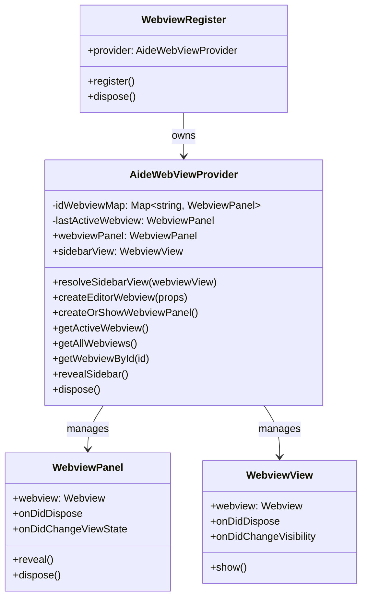

# Webview Register Module

## Module Overview

The Webview Register module provides the core infrastructure for creating, managing, and communicating with webview-based user interfaces in the Aide VSCode extension. It serves as the bridge between the extension's backend services and the frontend React application.

## Core Functionality

- **Webview Management**: Creation and lifecycle management of both sidebar and editor webviews
- **State Synchronization**: Bidirectional state synchronization between extension and webview
- **UI Integration**: Seamless integration with VSCode's webview API and extension UI
- **Message Passing**: Structured communication channel between extension and webview
- **Resource Management**: Proper handling of webview resources and cleanup
- **Multi-view Support**: Management of multiple concurrent webview instances

## Key Components

### Core Classes

- **webview-provider.ts**: Main provider class that manages webview instances

  - Creates and configures webview panels and views
  - Handles webview lifecycle events
  - Manages communication between extension and webviews
  - Tracks active and available webview instances

- **utils.ts**: Utility functions for webview operations

  - HTML content generation and manipulation
  - State injection into webview HTML
  - Resource path resolution for webview assets
  - Development server integration for hot reloading

- **types.ts**: Type definitions for the webview module
  - Defines the `WebviewState` interface for state synchronization
  - Provides type safety for webview communication

### Key Interfaces

- **AideWebViewProvider**: Main service class for webview management

  - Creates and manages webview instances
  - Provides methods for webview interaction
  - Handles webview lifecycle events

- **WebviewState**: Interface defining the state shared with webviews
  - Contains initialization parameters
  - Tracks webview identity and configuration
  - Manages routing and connection information

## Dependencies

The Webview Register module has the following key dependencies:

- **VSCode API**: For webview creation and management
- **Action Register**: For executing actions from webview UI
- **Register Manager**: For accessing other extension services
- **Command Manager**: For registering and executing commands
- **i18next**: For internationalization support
- **UUID**: For generating unique identifiers for webview instances

## Usage Examples

```typescript
// Creating and using a webview
import { WebviewRegister } from '@extension/registers/webview-register'

// Get the webview provider from the register
const webviewRegister = registerManager.getRegister(WebviewRegister)
const webviewProvider = webviewRegister.provider

// Create a new editor webview
await webviewProvider.createEditorWebview({
  title: 'Aide Chat',
  webviewState: {
    initRouterPath: '/chat'
  },
  showOptions: {
    viewColumn: vscode.ViewColumn.Two,
    preserveFocus: false
  }
})

// Access the active webview
const activeWebview = webviewProvider.getActiveWebview()
if (activeWebview) {
  // Interact with the webview
  console.log(
    `Active webview ID: ${webviewProvider.getIdByWebview(activeWebview)}`
  )
}

// Reveal the sidebar webview
webviewProvider.revealSidebar()
```

```typescript
// Registering the webview provider for use by other components
// This is typically done in the WebviewRegister.register() method

// Register the provider as a service
this.registerManager.commandManager.registerService(
  'AideWebViewProvider',
  this.provider
)

// Later, in another component:
const webviewProvider = commandManager.getService('AideWebViewProvider')
if (webviewProvider) {
  await webviewProvider.createEditorWebview({
    title: 'Settings',
    webviewState: {
      initRouterPath: '/settings'
    }
  })
}
```

## Architecture Notes

The Webview Register module follows a provider pattern architecture:



The module implements several key architectural patterns:

1. **Provider Pattern**: The `AideWebViewProvider` class serves as a central provider for webview services
2. **Registry Pattern**: Webviews are tracked in a registry (`idWebviewMap`) for lifecycle management
3. **Factory Pattern**: Methods like `createEditorWebview` act as factories for creating webview instances
4. **Observer Pattern**: Event listeners are used to respond to webview lifecycle events
5. **Dependency Injection**: The provider receives dependencies through its constructor

The webview system supports two main types of webviews:

1. **Sidebar Webview**: Integrated into the VSCode sidebar as a view
2. **Editor Webview**: Displayed as a separate panel in the editor area

Both types share the same underlying HTML content and communication mechanisms, but have different lifecycle management and UI integration approaches. The module handles these differences transparently, providing a unified API for interacting with both types of webviews.
