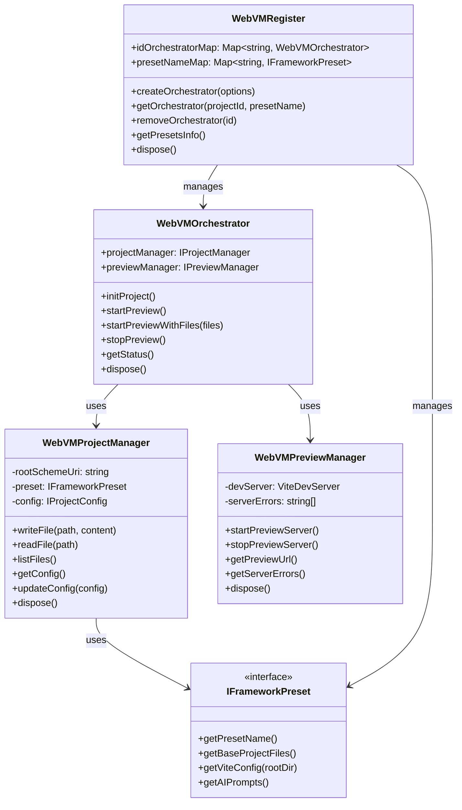

# WebVM Register Module

## Module Overview

The WebVM Register module provides a virtual machine environment for web application development and preview within the Aide VSCode extension. It enables AI-assisted creation, management, and real-time preview of web applications using various frontend frameworks.

## Core Functionality

- **Project Management**: Creation and management of web application projects with different frameworks
- **Live Preview**: Real-time preview of web applications using Vite development server
- **Framework Presets**: Support for multiple frontend frameworks through a preset system
- **File Operations**: Virtual file system for web project files
- **Dependency Management**: Handling of project dependencies and configurations
- **AI Integration**: Structured prompts and templates for AI-assisted web development

## Key Components

### Core Classes

- **index.ts**: Main entry point for WebVM registration

  - Manages WebVM orchestrators and presets
  - Provides methods for creating and accessing orchestrators
  - Handles orchestrator lifecycle and resource management

- **orchestrator.ts**: Coordinates project and preview management

  - Creates and initializes WebVM projects
  - Manages the lifecycle of projects and previews
  - Provides a unified interface for WebVM operations
  - Handles error management and status reporting

- **project-manager.ts**: Manages web project files and configuration

  - Creates and maintains project file structure
  - Handles file operations (read, write, delete)
  - Manages project configuration and dependencies
  - Integrates with framework presets for project setup

- **preview-manager.ts**: Handles live preview of web applications

  - Creates and manages Vite development server
  - Handles port allocation and server configuration
  - Provides preview URL and status information
  - Manages server lifecycle and error handling

- **types.ts**: Type definitions for the WebVM module

  - Defines interfaces for project and preview management
  - Specifies framework preset structure
  - Defines file and configuration types
  - Provides type safety for WebVM operations

- **presets/**: Framework-specific presets for web development
  - Contains preset implementations for different frameworks
  - Provides base project files and configurations
  - Defines AI prompts for framework-specific code generation
  - Handles framework-specific dependency management

### Key Interfaces

- **IFrameworkPreset**: Interface for framework presets

  - Provides base project files and configuration
  - Defines AI prompts for code generation
  - Handles framework-specific Vite configuration
  - Manages dependency resolution

- **IProjectManager**: Interface for project management

  - Handles file operations in the virtual file system
  - Manages project configuration and dependencies
  - Provides access to project metadata
  - Controls project lifecycle

- **IPreviewManager**: Interface for preview management
  - Controls the Vite development server
  - Provides preview URL and status information
  - Handles server errors and lifecycle
  - Manages port allocation and configuration

## Dependencies

The WebVM Register module has the following key dependencies:

- **Vite**: For development server and build tooling
- **VFS**: Virtual file system for project files
- **Find-Free-Ports**: For dynamic port allocation
- **i18next**: For internationalization support
- **Framework Libraries**: React, Vue, etc. (via CDN or local dependencies)

## Usage Examples

```typescript
// Creating and using a WebVM orchestrator
import { WebVMRegister } from '@extension/registers/webvm-register'

// Get the WebVM register from the register manager
const webvmRegister = registerManager.getRegister(WebVMRegister)

// Get available presets
const presets = webvmRegister.getPresetsInfo()
console.log(`Available presets: ${presets.map(p => p.presetName).join(', ')}`)

// Create a new orchestrator with a specific preset
const orchestrator = await webvmRegister.createOrchestrator({
  projectId: 'my-project',
  presetName: 'react'
})

// Get project status
const status = orchestrator.getStatus()
console.log(`Project initialized: ${status.isInitialized}`)

// Start preview server
await orchestrator.startPreview()
console.log(`Preview URL: ${orchestrator.getStatus().previewUrl}`)

// Clean up when done
await webvmRegister.removeOrchestrator('my-project:react')
```

```typescript
// Creating a project with AI-generated files
import { WebVMRegister } from '@extension/registers/webvm-register'

// Get or create an orchestrator
const orchestrator = await webvmRegister.getOrCreateOrchestrator(
  'my-project',
  'react'
)

// Generate files with AI (typically handled by an AI agent)
const files = [
  {
    relativePathOrSchemeUri: 'src/App.jsx',
    content:
      'import React from "react";\n\nexport default function App() {\n  return <div>Hello World</div>;\n}'
  },
  {
    relativePathOrSchemeUri: 'src/main.jsx',
    content:
      'import React from "react";\nimport ReactDOM from "react-dom/client";\nimport App from "./App";\n\nReactDOM.createRoot(document.getElementById("root")).render(<App />);'
  }
]

// Start preview with the generated files
await orchestrator.startPreviewWithFiles(files)

// Access the preview URL
const previewUrl = orchestrator.getStatus().previewUrl
console.log(`Preview available at: ${previewUrl}`)
```

## Architecture Notes

The WebVM Register module follows a layered architecture pattern:



The module implements several key architectural patterns:

1. **Factory Pattern**: Static `create` methods for creating orchestrators and project managers
2. **Strategy Pattern**: Framework presets implement different strategies for project setup
3. **Facade Pattern**: The orchestrator provides a simplified interface to complex subsystems
4. **Registry Pattern**: WebVM register maintains a registry of orchestrators and presets
5. **Dependency Injection**: Components receive dependencies through constructors

The WebVM system supports multiple frontend frameworks through its preset system:

1. **React**: Modern React applications with optional TypeScript support
2. **Vue**: Vue.js applications with composition API
3. **Svelte**: Svelte applications with component-based architecture
4. **Angular**: Angular applications with TypeScript
5. **Other Frameworks**: Extensible system for adding new framework presets

The virtual machine concept is implemented through a combination of:

1. **Virtual File System**: Files are stored in memory or in a dedicated storage area
2. **Vite Development Server**: Provides real-time preview and hot module replacement
3. **CDN Integration**: Dependencies can be loaded from CDNs for faster development
4. **Port Management**: Dynamic allocation of ports for preview servers

This architecture enables AI-assisted web development with immediate visual feedback, allowing users to iterate quickly on web application designs and implementations.
