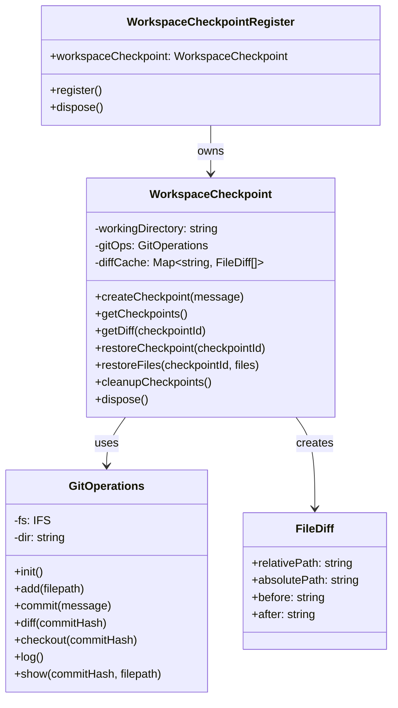

# Workspace Checkpoint Register Module

## Module Overview

The Workspace Checkpoint Register module provides a robust system for creating, managing, and restoring checkpoints of the workspace file system within the Aide VSCode extension. It enables safe experimentation with AI-generated code changes by allowing users to easily revert to previous states.

## Core Functionality

- **Checkpoint Creation**: Capture the current state of workspace files at specific points in time
- **State Restoration**: Revert workspace files to previously saved checkpoints
- **Diff Tracking**: Track and visualize differences between current state and checkpoints
- **Git Integration**: Utilize Git's version control capabilities for efficient state management
- **Selective Restoration**: Restore specific files or entire workspace to previous states
- **Automatic Cleanup**: Manage checkpoint lifecycle with proper resource cleanup

## Key Components

### Core Classes

- **workspace-checkpoint.ts**: Main implementation of the checkpoint system

  - Creates and manages workspace checkpoints
  - Handles file tracking and state comparison
  - Provides methods for restoring previous states
  - Implements checkpoint lifecycle management

- **git-operations.ts**: Git-based operations for checkpoint management

  - Wraps isomorphic-git functionality for version control
  - Handles commit, diff, and restore operations
  - Provides file history and change tracking
  - Manages Git repository initialization and configuration

- **index.ts**: Entry point for the workspace checkpoint register

  - Initializes the checkpoint system
  - Registers the checkpoint service with the extension
  - Handles lifecycle events for the register

- **types.ts**: Type definitions for the checkpoint module
  - Defines the `FileDiff` interface for tracking file changes
  - Provides type safety for checkpoint operations

### Key Interfaces

- **WorkspaceCheckpoint**: Main service class for checkpoint management

  - Creates and restores checkpoints
  - Tracks file changes between checkpoints
  - Provides methods for comparing file states
  - Manages checkpoint metadata

- **FileDiff**: Interface representing differences between file versions
  - Tracks file paths (relative and absolute)
  - Stores before and after content for comparison
  - Used for visualization and selective restoration

## Dependencies

The Workspace Checkpoint Register module has the following key dependencies:

- **isomorphic-git**: For Git operations without requiring a Git installation
- **VFS**: Virtual file system for file operations
- **async-mutex**: For thread-safe checkpoint operations
- **crypto**: For secure file content comparison
- **i18next**: For internationalization support

## Usage Examples

```typescript
// Creating and using workspace checkpoints
import { WorkspaceCheckpointRegister } from '@extension/registers/workspace-checkpoint-register'

// Get the workspace checkpoint service from the register
const checkpointRegister = registerManager.getRegister(
  WorkspaceCheckpointRegister
)
const checkpoint = checkpointRegister.workspaceCheckpoint

// Create a new checkpoint
const checkpointId = await checkpoint.createCheckpoint('Before AI changes')

// Make some changes to the workspace...

// Get differences between current state and checkpoint
const diffs = await checkpoint.getDiff(checkpointId)
console.log(`Changed files: ${diffs.length}`)

// Restore the entire workspace to the checkpoint
await checkpoint.restoreCheckpoint(checkpointId)

// Or restore specific files
await checkpoint.restoreFiles(checkpointId, ['src/main.ts', 'src/app.ts'])

// Clean up old checkpoints
await checkpoint.cleanupCheckpoints()
```

```typescript
// Using the checkpoint system in an AI code generation workflow
import { WorkspaceCheckpointRegister } from '@extension/registers/workspace-checkpoint-register'

// Get the workspace checkpoint service
const checkpoint = registerManager.getRegister(
  WorkspaceCheckpointRegister
).workspaceCheckpoint

// Create a checkpoint before applying AI changes
const checkpointId = await checkpoint.createCheckpoint('Before AI refactoring')

try {
  // Apply AI-generated code changes
  await applyAIChanges()

  // If successful, create another checkpoint
  await checkpoint.createCheckpoint('After successful AI refactoring')
} catch (error) {
  // If something goes wrong, restore the previous state
  await checkpoint.restoreCheckpoint(checkpointId)
  console.log('Restored workspace to state before AI changes')
}
```

## Architecture Notes

The Workspace Checkpoint Register module follows a layered architecture pattern:



The module implements several key architectural patterns:

1. **Repository Pattern**: Git operations are encapsulated in a dedicated class
2. **Factory Pattern**: Static `create` method for creating checkpoint instances
3. **Cache Pattern**: Diff results are cached for performance optimization
4. **Mutex Pattern**: Thread-safe operations using async-mutex
5. **Facade Pattern**: WorkspaceCheckpoint provides a simplified interface to complex Git operations

The checkpoint system uses Git as its underlying version control mechanism, but abstracts away the Git-specific details to provide a simple, high-level API for checkpoint management. This approach leverages Git's powerful version control capabilities while providing a user-friendly interface tailored to the needs of AI-assisted code generation.

The system is designed to be efficient with resources, using file hashing to detect changes and only storing differences between states. It also includes automatic cleanup mechanisms to prevent excessive disk usage from accumulated checkpoints.
