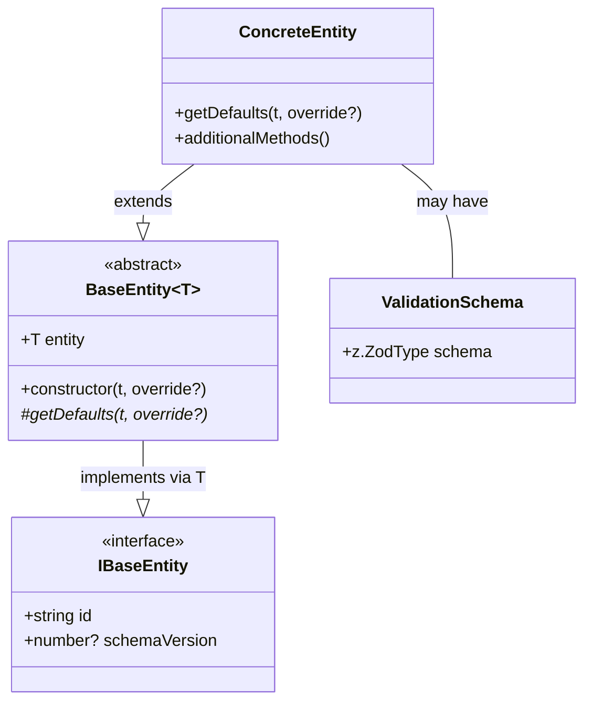

# Entities Module

## Module Overview

The Entities module provides a comprehensive set of data models that represent the core domain objects used throughout the Aide VSCode extension. It serves as the foundation for data manipulation, persistence, and state management across the application, ensuring consistent data structures and behaviors.

## Core Functionality

- **Entity Management**: Standardized base classes and interfaces for creating, validating, and manipulating domain objects
- **Data Modeling**: Type-safe representation of AI providers, models, chat sessions, and other application constructs
- **State Persistence**: Structures designed for efficient serialization and deserialization to support data storage
- **Domain Type Safety**: TypeScript interfaces and types that ensure consistent data handling across the application
- **Identity Management**: Automatic UUID generation and management for all entity instances
- **Configuration Schema Validation**: Zod schemas for runtime validation of entity configurations

## Key Components

### Base Infrastructure

- **base-entity.ts**: Defines the foundational `BaseEntity` abstract class that all other entities extend, providing common functionality like ID management

### AI Provider & Model Entities

- **ai-provider-entity/**: Contains provider-specific entity classes for different AI services
  - **base.ts**: Base class for AI providers with common functionality
  - **anthropic.ts, openai.ts, etc.**: Provider-specific implementations
- **ai-model-entity.ts**: Represents AI models and their capabilities (chat, image, audio, tools)

### Chat & Conversation Entities

- **chat-context-entity.ts**: Manages the overall chat context including conversations and settings
- **chat-session-entity.ts**: Represents individual chat sessions
- **conversation-entity.ts**: Models the structure of conversations, including messages, mentions, and agent interactions
- **prompt-snippet-entity.ts**: Stores reusable prompt templates

### Project & Integration Entities

- **project-entity.ts**: Represents user projects
- **git-project-entity.ts**: Tracks Git repository information
- **doc-site-entity.ts**: Manages documentation sites for integration
- **web-preview-project-entity.ts**: Handles web preview project configurations
- **mcp-entity.ts**: Supports Model Context Protocol integration

### Configuration Entities

- **setting-entity/**: Contains settings-related entities and configurations
- **internal-config-entity.ts**: Manages internal application configurations

## Dependencies

The Entities module has the following key dependencies:

- **uuid**: Used for generating unique identifiers for each entity
- **zod**: Provides runtime schema validation for entity configurations
- **i18next**: Used for internationalization support in validation messages and defaults
- **@modelcontextprotocol/sdk**: Integration with the Model Context Protocol
- **@langchain/core**: Types for chat messages and tools integration

## Usage Examples

```typescript
// Creating a new chat context
import { ChatContextEntity, ChatContextType } from '@shared/entities'
import { t } from 'i18next'

// Create a new chat context with optional overrides
const chatContext = new ChatContextEntity(t, {
  type: ChatContextType.Chat,
  conversations: []
})

// Access the entity properties
console.log(chatContext.entity.id) // Unique UUID
console.log(chatContext.entity.type) // "chat"

// Convert to a chat session
const chatSession = chatContext.toChatSession(t)
```

## Architecture Notes

The Entities module follows a consistent architecture pattern:



Each entity in the system inherits from the `BaseEntity` abstract class, which provides common functionality and ensures consistency across different entity types. The module uses a factory pattern in several places (like `ai-provider-entity`) to instantiate the correct entity subtype based on runtime information.

Entity validation is handled through Zod schemas, which are often exported alongside the entity classes to enable runtime validation before entity creation. This dual approach of TypeScript interfaces and Zod schemas provides both compile-time and runtime type safety.

The entities are designed to be serializable for persistence in storage systems and transmission between extension components. They generally avoid methods that would not serialize well and instead focus on maintaining a clean data structure that can be easily stored and retrieved.
