# Agents Module

## Module Overview

The Agents Module provides a comprehensive framework for integrating AI-powered tools and capabilities into the Aide VSCode extension. It implements a plugin-based architecture that enables various AI agents to perform specialized tasks such as code search, file editing, web search, and document retrieval, enhancing the extension's ability to assist developers with complex coding tasks.

## Core Functionality

- **Agent Plugin Framework**: Standardized architecture for creating, registering, and executing AI agent plugins with consistent interfaces
- **Tool Integration**: Seamless integration with VSCode's AI tools API, enabling AI models to interact with the codebase and external resources
- **Client-Server Architecture**: Split implementation between client-side UI components and server-side execution logic for each agent
- **Extensibility**: Modular design allowing for easy addition of new agent capabilities without modifying core extension code
- **Context Management**: Robust context handling for maintaining state during agent execution and interaction with AI models
- **Model Protocol Support**: Integration with Model Context Protocol (MCP) for standardized communication with various AI models

## Key Components

### Base Infrastructure

- **types.ts**: Defines the core types and enums used across all agent plugins, including the `AgentPluginId` enum
- **generate-vscode-ai-tools-declare-json.ts**: Generates VSCode AI tools declarations for package.json, enabling integration with VSCode's AI features

#### Server Components

- **agent-server-plugin-registry.ts**: Central registry for managing server-side agent plugins, handling plugin lifecycle and dependencies
- **agent-server-plugin-context.ts**: Provides context and services to server-side agent plugins during execution
- **create-agent-provider-manager.ts**: Factory for creating provider managers that handle agent execution
- **agent-server-plugins.ts**: Collection of server-side plugin implementations

#### Client Components

- **agent-client-plugin-context.tsx**: React context provider for client-side agent plugins
- **agent-client-plugins.ts**: Collection of client-side plugin implementations
- **agent-client-plugin-types.ts**: Type definitions for client-side plugin interfaces
- **create-agent-client-plugin.ts**: Factory function for creating client-side agent plugins

### Agent Plugins

#### Codebase Search Agent

Provides semantic search capabilities for finding relevant code snippets within the workspace.

- **codebase-search-agent.ts**: Implements semantic search over the codebase using vector embeddings
- **types.ts**: Defines types for search results and code snippets

#### Document Retriever Agent

Searches and retrieves information from documentation sites.

- **doc-retriever-agent.ts**: Implements search across documentation sites with keyword-based queries
- **types.ts**: Defines types for documentation search results

#### Edit File Agent

Enables AI-assisted editing of files in the workspace.

- **edit-file-agent.ts**: Implements file editing capabilities with intelligent context handling
- **edit-file-agent-floating-item.tsx**: UI component for displaying edit suggestions in a floating window
- **edit-file-agent-message-item.tsx**: UI component for displaying edit suggestions in chat messages
- **shared.ts**: Shared utilities and types for file editing operations

#### MCP Tool Agent

Provides integration with the Model Context Protocol for standardized tool execution.

- **create-mcp-tool-agent-class.ts**: Factory for creating agent classes that communicate with MCP-compatible models

#### Read Files Agent

Enables reading file contents with intelligent context handling.

- **read-files-agent.ts**: Implements file reading capabilities with line range support and outline generation

#### Web Preview Agent

Provides web application preview capabilities within VSCode.

- **web-preview-agent.ts**: Implements web preview functionality for generated web applications
- **shared.ts**: Shared utilities and types for web preview operations

#### Web Search Agent

Enables web search capabilities for retrieving up-to-date information.

- **web-search-agent.ts**: Implements web search using search engines with content extraction and analysis

#### Web Visit Agent

Enables visiting specific web pages and extracting their content.

- **web-visit-agent.ts**: Implements web page visiting and content extraction capabilities
- **types.ts**: Defines types for web content information

## Dependencies

The Agents Module has the following key dependencies:

- **VSCode API**: Integration with VSCode's extension and AI tools APIs
- **Base Agent Framework**: Core agent implementation from `@extension/chat/strategies/_base`
- **Virtual File System**: File operations via `@extension/file-utils/vfs`
- **Zod**: Schema validation for agent inputs and outputs
- **React**: UI components for client-side agent rendering
- **LangChain**: Utilities for AI model interaction and content processing
- **Model Provider Factory**: Integration with various AI model providers

## Usage Examples

```typescript
// Registering an agent plugin in the server-side registry
import { AgentServerPluginRegistry } from '@shared/plugins/agents/_base/server/agent-server-plugin-registry'
import { EditFileAgentServerPlugin } from '@shared/plugins/agents/edit-file-agent-plugin/server/edit-file-agent-server-plugin'

export async function registerAgentPlugins(
  registry: AgentServerPluginRegistry
) {
  // Register the edit file agent plugin
  await registry.loadPlugin(new EditFileAgentServerPlugin())

  // Get a registered plugin
  const editFilePlugin = registry.getPlugin(AgentPluginId.EditFile)
}
```

```typescript
// Using agents in a workflow node
import { BaseNode } from '@shared/plugins/_shared/strategies'
import { DocRetrieverAgent } from '@shared/plugins/agents/doc-retriever-agent-plugin/server/doc-retriever-agent'
import { ChatContextOperator } from '@shared/utils/chat-context-helper/common/chat-context-operator'

export class CustomNode extends BaseNode {
  // Initialize the node and register agent configurations
  onInit() {
    // Register an agent configuration with dynamic state-based configuration
    this.registerAgentConfig(DocRetrieverAgent.name, state => {
      // Extract relevant state from the conversation context
      const chatContextOp = new ChatContextOperator(state.chatContext)
      const lastConversationOp =
        chatContextOp.getLastAvailableConversationOperator()

      // Configure agent based on conversation state
      const disabledAgent = !someCondition

      // Create and return the agent configuration
      return this.createAgentConfig({
        disabledAgent,
        agentClass: DocRetrieverAgent,
        agentContext: {
          state,
          strategyOptions: this.context.strategyOptions,
          createToolOptions: {
            // Agent-specific options
            someOption: 'value'
          }
        }
      })
    })
  }

  // Execute the node with the current state
  async execute(state) {
    // Execute the agent and get results
    const toolCallsResults = await this.executeAgentTool(
      'think',
      state,
      {
        agentClass: DocRetrieverAgent
      },
      // Optional filter for agent results
      agent => Boolean(agent.output.someProperty)
    )

    // Process results and update state
    if (!toolCallsResults.agents.length) return {}

    // Add agents to the conversation
    const newConversations = this.addAgentsToNewConversation(
      state.newConversations,
      toolCallsResults.agents
    )

    // Return updated state
    return {
      chatContext: state.chatContext,
      newConversations
    }
  }
}
```

```typescript
// Building agent tools for a strategy
import {
  createGraphNodeFromNodes,
  createToolsFromNodes
} from '@shared/plugins/_shared/strategies'

import { DocRetrieverNode } from './doc-retriever-node'

export class CustomStrategyProvider {
  // Build tools for the strategy
  async buildAgentTools(strategyOptions, state) {
    // Create tools from node classes
    return await createToolsFromNodes({
      nodeClasses: [DocRetrieverNode],
      strategyOptions,
      state
    })
  }

  // Build graph nodes for the LangGraph workflow
  async buildLanggraphToolNodes(strategyOptions) {
    // Create graph nodes from node classes
    return await createGraphNodeFromNodes({
      nodeClasses: [DocRetrieverNode],
      strategyOptions
    })
  }
}
```

## Architecture Notes

The Agents Module follows a plugin-based architecture with a clear separation between client and server components:

```mermaid
classDiagram
    class BaseAgent {
        <<abstract>>
        +name: string
        +type: string
        +description: string
        +inputSchema: ZodSchema
        +outputSchema: ZodSchema
        +execute(input) Promise~output~
    }

    class BaseNode {
        <<abstract>>
        #registerAgentConfig(name, configFn)
        #createAgentConfig(config)
        #executeAgentTool(mode, state, options, filter)
        #addAgentsToNewConversation(conversations, agents)
        +onInit()
        +execute(state) Promise~Partial~State~~
    }

    class AgentServerPluginRegistry {
        -plugins: Map
        -pluginContexts: Map
        -commands: Map
        +providerManagers
        +loadPlugin(plugin)
        +getPlugin(pluginId)
        +unloadPlugin(pluginId)
    }

    class AgentServerPlugin {
        <<interface>>
        +id: AgentPluginId
        +dependencies: AgentPluginId[]
        +activate(context)
        +deactivate()
    }

    class AgentClientPlugin {
        <<interface>>
        +id: AgentPluginId
        +providers: AgentClientPluginProviderMap
    }

    BaseAgent <|-- CodebaseSearchAgent
    BaseAgent <|-- DocRetrieverAgent
    BaseAgent <|-- EditFileAgent
    BaseAgent <|-- WebSearchAgent
    BaseAgent <|-- WebVisitAgent
    BaseAgent <|-- ReadFilesAgent
    BaseAgent <|-- WebPreviewAgent
    BaseAgent <|-- McpToolAgent

    BaseNode --> BaseAgent : configures and executes

    AgentServerPlugin <|-- CodebaseSearchAgentServerPlugin
    AgentServerPlugin <|-- DocRetrieverAgentServerPlugin
    AgentServerPlugin <|-- EditFileAgentServerPlugin
    AgentServerPlugin <|-- WebSearchAgentServerPlugin
    AgentServerPlugin <|-- WebVisitAgentServerPlugin
    AgentServerPlugin <|-- ReadFilesAgentServerPlugin
    AgentServerPlugin <|-- WebPreviewAgentServerPlugin

    AgentServerPluginRegistry o-- AgentServerPlugin : manages

    AgentClientPlugin <|-- CodebaseSearchAgentClientPlugin
    AgentClientPlugin <|-- DocRetrieverAgentClientPlugin
    AgentClientPlugin <|-- EditFileAgentClientPlugin
    AgentClientPlugin <|-- WebSearchAgentClientPlugin
    AgentClientPlugin <|-- WebVisitAgentClientPlugin
    AgentClientPlugin <|-- ReadFilesAgentClientPlugin
    AgentClientPlugin <|-- WebPreviewAgentClientPlugin
```



The agent system follows these key principles:

1. **Plugin Architecture**: Each agent is implemented as a plugin with both client and server components
2. **Base Agent Pattern**: All agents extend the `BaseAgent` class, providing a consistent interface
3. **Node-Based Execution**: Agents are configured and executed within workflow nodes that extend the `BaseNode` class
4. **Dynamic Configuration**: Agent configurations can be dynamically determined based on conversation state
5. **Schema Validation**: Input and output schemas are defined using Zod for type safety and validation
6. **UI Integration**: Client plugins provide React components for rendering agent UI in various contexts
7. **Registry Pattern**: Server plugins are registered with a central registry that manages their lifecycle
8. **VSCode Integration**: Agents are exposed as VSCode AI tools through the package.json declarations

The execution flow for an agent typically follows these steps:

1. A workflow node registers agent configurations during initialization
2. When the node is executed, it configures and executes the appropriate agents based on the current state
3. Agent results are processed and incorporated into the conversation
4. State changes are propagated through the workflow graph
5. The client-side plugin renders the results in the appropriate UI context

This architecture enables a flexible and extensible system for adding new AI-powered capabilities to the Aide VSCode extension while maintaining a consistent user experience and robust error handling.
