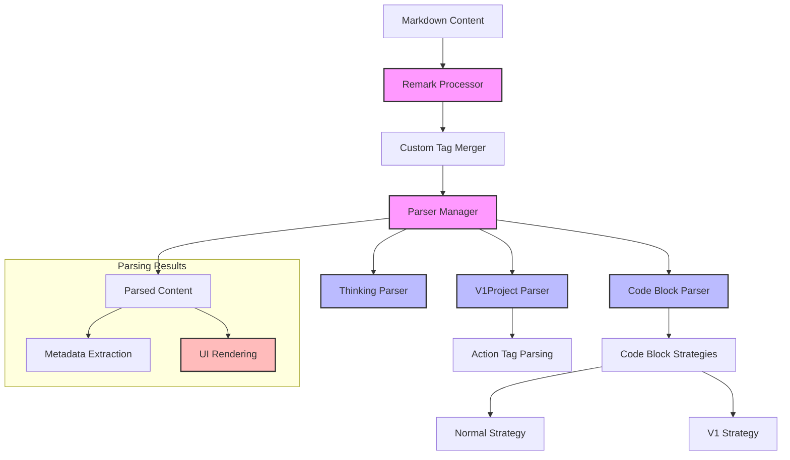

# Markdown Module

## Module Overview

The Markdown Module provides a comprehensive framework for parsing, extracting, and processing structured markdown content in the Aide VSCode extension. It specializes in handling custom markdown tags and code blocks that contain metadata agreed upon between the AI and the application, enabling rich UI rendering and metadata extraction for enhanced AI-human interaction.

## Core Functionality

- **Custom Tag Processing**: Parses and extracts custom XML-like tags embedded in markdown for specialized UI rendering
- **Metadata Extraction**: Identifies and extracts structured metadata from markdown content for programmatic use
- **Code Block Analysis**: Processes code blocks with special annotations to extract file paths, line numbers, and other metadata
- **Extensible Parsing**: Provides a plugin-based architecture for adding new markdown parsing capabilities
- **UI Rendering Support**: Enables rich, interactive UI components based on structured markdown content

## Key Components

### Parsers

- **\_base/**: Contains the foundational classes and interfaces for the parsing system

  - **base-parser.ts**: Abstract base class that all parsers extend
  - **types.ts**: Core type definitions for parse results and custom tags
  - **parser-manager.ts**: Registry for managing and accessing different parsers

- **code-block-parser/**: Specialized parsers for code blocks with metadata

  - **index.ts**: Main code block parser implementation
  - **base-code-block-strategy.ts**: Strategy pattern interface for code block parsing
  - **normal-code-block-strategy.ts**: Strategy for standard code blocks
  - **v1-code-block-strategy.ts**: Strategy for V1 project code blocks

- **v1-project-parser.ts**: Parser for V1 project tags that contain web application code

  - Extracts project structure, file contents, and configuration
  - Supports various code types (nodejs, html, markdown, diagram)
  - Processes nested action tags like MoveFile, DeleteFile, and QuickEdit

- **thinking-parser.ts**: Parser for AI thinking process tags
  - Extracts AI reasoning and thought process information
  - Enables visualization of AI decision-making steps

### Utilities

- **extract-custom-blocks.ts**: Core utility for extracting custom XML-like blocks

  - Identifies and extracts custom tags with their attributes and content
  - Handles both self-closing and paired tags
  - Preserves attribute values and structure

- **code-block-utils.ts**: Utilities for processing code blocks

  - Extracts metadata from code block info strings
  - Parses file paths, line numbers, and language information
  - Supports special syntax for code block annotations

- **fix-markdown-content.ts**: Utilities for normalizing markdown content

  - Fixes common markdown formatting issues
  - Ensures consistent processing across different markdown sources

- **common.ts**: Shared utility functions
  - Provides helper functions for markdown processing
  - Includes validation and normalization utilities

## Custom Tags

The module supports several custom tags that enable specialized UI rendering and metadata extraction:

### V1Project Tag

````markdown
<V1Project presetName="react">
  Content describing a web application project
  
  ```jsx path=src/App.jsx
  function App() {
    return <div>Hello World</div>;
  }
````

  <MoveFile fromFilePath="src/old.js" toFilePath="src/new.js" />
  <DeleteFile filePath="src/unused.js" />
  <QuickEdit filePath="src/config.js">
    // New content for the file
  </QuickEdit>
</V1Project>
```

- Represents a complete web application project
- Contains code blocks with file paths and content
- Includes action tags for file operations
- Supports different project presets (react, vue, etc.)

### Thinking Tag

```markdown
<Thinking>
  First, I'll analyze the requirements.
  Then, I'll design the component structure.
  Finally, I'll implement the solution.
</Thinking>
```

- Represents AI's thinking process
- Enables visualization of AI reasoning steps
- Helps users understand AI decision-making

## Dependencies

The Markdown Module has the following key dependencies:

- **mdast**: Markdown Abstract Syntax Tree utilities
- **unified/remark**: Markdown processing ecosystem
- **unist-util-visit**: AST traversal utilities
- **js-base64**: Encoding/decoding utilities for content preservation

## Usage Examples

```typescript
// Parsing markdown with custom tags
import {
  CodeBlockParser,
  ThinkingParser,
  V1ProjectParser
} from '@shared/plugins/markdown/parsers'
import { ParserManager } from '@shared/plugins/markdown/parsers/_base/parser-manager'

function parseMarkdownWithCustomTags(markdown: string) {
  // Create a parser manager with all required parsers
  const parserManager = new ParserManager()
  parserManager.registerParser(new V1ProjectParser())
  parserManager.registerParser(new ThinkingParser())
  parserManager.registerParser(new CodeBlockParser())

  // Parse the markdown content
  const parseResults = parserManager.parse(markdown)

  // Process the results
  parseResults.forEach(result => {
    if (result.type === 'xml' && result.tagName === 'V1Project') {
      // Handle V1Project tag
      const projectInfo = result as V1ProjectTagInfo
      const projectName = projectInfo.otherInfo.presetName
      const contents = projectInfo.otherInfo.parseContents

      // Process project contents
      contents.forEach(content => {
        if (content.type === 'code') {
          // Handle code blocks
          const filePath = content.otherInfo?.v1ProjectFilePath
          const codeContent = content.content
          // Create or update file
        }
      })
    }
  })
}
```

```typescript
// Extracting custom blocks from markdown
import { extractCustomBlocks } from '@shared/plugins/markdown/utils/extract-custom-blocks'

function extractCustomContent(markdown: string) {
  // Extract custom blocks
  const { processedMarkdown, customBlocks } = extractCustomBlocks(markdown, [
    'V1Project',
    'Thinking',
    'MoveFile',
    'DeleteFile',
    'QuickEdit'
  ])

  // Process custom blocks
  customBlocks.forEach(block => {
    const { tagName, attrs, content, isBlockClosed } = block

    if (tagName === 'V1Project') {
      // Handle V1Project block
      const presetName = attrs.presetName as string
      console.log(`Found V1Project with preset: ${presetName}`)
      console.log(`Content: ${content}`)
    }
  })

  return processedMarkdown
}
```

## Architecture Notes

The Markdown Module follows a modular architecture with clear separation of concerns:



The system follows these key design principles:

1. **Parser Composition**: Different parsers handle specific aspects of markdown content
2. **Strategy Pattern**: Flexible strategies for different types of code blocks
3. **AST Transformation**: Works with the markdown AST for precise content manipulation
4. **Type Safety**: Strong typing for parsed results and metadata
5. **Extensibility**: Easy addition of new parsers and custom tags

The processing flow typically follows these steps:

1. Markdown content is processed by the remark processor
2. Custom tags are identified and merged across AST nodes
3. The parser manager delegates parsing to specialized parsers
4. Each parser extracts relevant information from its assigned content
5. Parsed results are used for metadata extraction and UI rendering

This architecture provides a flexible and extensible foundation for processing structured markdown content with custom tags, enabling rich UI rendering and metadata extraction for enhanced AI-human interaction in the Aide VSCode extension.
