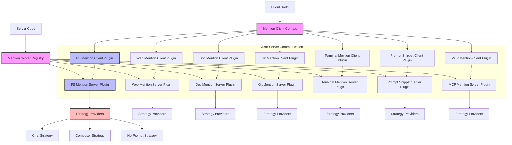

# Mentions Module

## Module Overview

The Mentions Module provides a plugin-based framework for integrating contextual information into AI conversations in the Aide VSCode extension. It enables the "@mention" functionality in the chat input, allowing users to reference various resources (files, web content, documentation, git information, etc.) that are then incorporated into the AI context prompt, enhancing the relevance and accuracy of AI responses.

## Core Functionality

- **@Mention UI Integration**: Provides a user-friendly interface for mentioning various resources directly in the chat input with autocomplete suggestions
- **Context Enrichment**: Transforms mentioned resources into structured context that enhances AI model understanding of the user's environment
- **Plugin Architecture**: Extensible plugin system allowing different types of resources to be mentioned and processed
- **State Management**: Handles the transformation of mentions into appropriate state representations for AI context
- **Multi-Strategy Support**: Compatible with different conversation strategies (chat, composer, no-prompt) with strategy-specific context formatting

## Key Components

### Base Framework

- **\_base/**: Contains the foundational classes and interfaces for the mentions system
  - **types.ts**: Defines the core `MentionPluginId` enum used across all mention plugins
  - **base-to-state.ts**: Abstract base class for transforming mentions into state representations
  - **client/**: Client-side framework for mention UI components and hooks
    - **mention-client-plugin-types.ts**: Type definitions for client-side plugin interfaces
    - **create-mention-client-plugin.ts**: Factory function for creating client-side mention plugins
    - **mention-client-plugin-context.tsx**: React context provider for client-side mention plugins
    - **mention-client-plugins.ts**: Collection of client-side plugin implementations
    - **use-localized-label.ts**: Hook for localized mention labels
  - **server/**: Server-side framework for mention processing
    - **mention-server-plugin-registry.ts**: Central registry for managing server-side mention plugins
    - **mention-server-plugin-context.ts**: Provides context and services to server-side mention plugins
    - **create-mention-provider-manager.ts**: Factory for creating provider managers
    - **mention-server-plugins.ts**: Collection of server-side plugin implementations

### Mention Plugins

#### File System Mention Plugin

- **Purpose**: Enables referencing files, folders, code snippets, and project structures in conversations
- **Capabilities**:
  - Allows mentioning specific files to include their content in the AI context
  - Supports folder mentions to provide directory structure information
  - Enables code snippet mentions with syntax highlighting and line references
  - Provides project structure mentions for giving AI an overview of the codebase
  - Includes error mentions to share compiler/linter errors with the AI
- **Use Cases**:
  - Asking AI about specific code files without manually copying content
  - Getting AI assistance with errors and warnings in the codebase
  - Providing AI with context about project structure for better recommendations

#### Web Mention Plugin

- **Purpose**: Enables referencing web content and URLs in conversations
- **Capabilities**:
  - Allows mentioning web pages to include their content in the AI context
  - Extracts relevant information from web pages for more focused context
  - Supports different content types (articles, documentation, forums)
  - Handles authentication for accessing private or restricted content
- **Use Cases**:
  - Asking AI to explain concepts from online documentation
  - Getting AI to analyze information from web resources
  - Comparing code with online examples or standards

#### Documentation Mention Plugin

- **Purpose**: Enables referencing documentation resources in conversations
- **Capabilities**:
  - Provides access to official documentation for programming languages and libraries
  - Allows mentioning specific documentation sections or topics
  - Supports structured documentation formats (MDX, API references, etc.)
  - Integrates with documentation search functionality
- **Use Cases**:
  - Getting AI explanations of library functions with official documentation context
  - Asking AI to compare code with best practices from documentation
  - Learning how to implement features with guidance from documentation

#### Git Mention Plugin

- **Purpose**: Enables referencing git repositories and related information
- **Capabilities**:
  - Allows mentioning git repositories to provide project context
  - Supports referencing specific commits, branches, or pull requests
  - Enables diff mentions to show code changes over time
  - Provides commit history context for understanding code evolution
- **Use Cases**:
  - Asking AI about the purpose of specific code changes
  - Getting AI to explain the history of a feature or bug
  - Providing context about collaborative development workflows

#### Terminal Mention Plugin

- **Purpose**: Enables referencing terminal output and commands in conversations
- **Capabilities**:
  - Allows mentioning terminal sessions to include command outputs
  - Supports command history mentions for showing sequences of operations
  - Enables error output mentions for troubleshooting
  - Provides build and test output context
- **Use Cases**:
  - Asking AI to explain error messages from command outputs
  - Getting AI assistance with debugging build failures
  - Providing context about system configuration and environment

#### Prompt Snippet Mention Plugin

- **Purpose**: Enables referencing predefined prompt snippets in conversations
- **Capabilities**:
  - Allows mentioning saved prompt templates and snippets
  - Supports parameterized prompt snippets for customization
  - Enables sharing and reusing effective prompting patterns
  - Provides specialized prompts for different development tasks
- **Use Cases**:
  - Quickly applying effective prompting patterns to new conversations
  - Standardizing AI interactions across a development team
  - Creating specialized prompts for recurring development tasks

#### MCP Mention Plugin

- **Purpose**: Enables referencing Model Context Protocol resources in conversations
- **Capabilities**:
  - Integrates with the Model Context Protocol for standardized context handling
  - Allows mentioning MCP-compatible resources and tools
  - Supports structured data exchange with AI models
  - Enables advanced context management for complex interactions
- **Use Cases**:
  - Providing standardized context to different AI models
  - Enabling interoperability between different AI tools and services
  - Supporting advanced AI capabilities through structured context

## Dependencies

The Mentions Module has the following key dependencies:

- **VSCode API**: Integration with VSCode's extension APIs
- **React**: UI components for client-side mention rendering
- **Shared Entities**: Common types and interfaces used across the extension
- **File Utils**: Utilities for file system operations via `@extension/file-utils`
- **LangChain**: Tools and utilities for AI model interaction
- **Chat Strategies**: Integration with various conversation strategies

## Usage Examples

```typescript
// Client-side: Using mention options in a component
import { useMentionContext } from '@shared/plugins/mentions/_base/client/mention-client-plugin-context'
import { MentionPluginId } from '@shared/plugins/mentions/_base/types'

function ChatInput() {
  // Get mention options from all registered plugins
  const { useMentionOptions } = useMentionContext()
  const mentionOptions = useMentionOptions()

  // Filter options by plugin ID if needed
  const fileMentionOptions = mentionOptions.filter(
    option => option.pluginId === MentionPluginId.Fs
  )

  // Render mention options in autocomplete dropdown
  return (
    <div>
      <input type="text" placeholder="Type @ to mention..." />
      {showMentionDropdown && (
        <MentionDropdown options={mentionOptions} />
      )}
    </div>
  )
}
```

```typescript
// Server-side: Processing mentions in a strategy provider
import type { Conversation } from '@shared/entities'
import { FsToState } from '@shared/plugins/mentions/fs-mention-plugin/fs-to-state'

export class CustomStrategyProvider {
  async buildContextMessagePrompt(conversation: Conversation): Promise<string> {
    // Create a state transformer for the conversation
    const fsToState = new FsToState(conversation)

    // Get mention state
    const mentionState = fsToState.toMentionsState()

    // Extract file mentions
    const { files, folders, codeSnippets } = mentionState

    // Build context prompt with mentioned resources
    let contextPrompt = ''

    if (files.length > 0) {
      contextPrompt += `\n\n## Referenced Files\n\n${this.formatFiles(files)}`
    }

    if (codeSnippets.length > 0) {
      contextPrompt += `\n\n## Code Snippets\n\n${this.formatCodeSnippets(codeSnippets)}`
    }

    return contextPrompt
  }
}
```

## Architecture Notes

The Mentions Module follows a plugin-based architecture with a clear separation between client and server components:



The system follows these key design principles:

1. **Plugin Architecture**: Different mention types are implemented as plugins with consistent interfaces
2. **Client-Server Split**: Clear separation between UI components (client) and processing logic (server)
3. **Strategy-Specific Formatting**: Each conversation strategy can format mentions differently
4. **State Transformation**: Mentions are transformed into state representations for AI context
5. **Extensibility**: New mention types can be added without modifying core code

The execution flow typically follows these steps:

1. User types "@" in the chat input, triggering the mention UI
2. Client plugins provide mention options in the dropdown
3. User selects a mention, which is added to the conversation
4. When sending a message, server plugins process the mentions
5. Strategy providers format the mentions into context for the AI model
6. AI responds with enhanced understanding of the mentioned resources

This architecture provides a flexible and extensible foundation for integrating various types of contextual information into AI conversations, enhancing the AI's ability to understand and respond to user queries in the context of their development environment.
