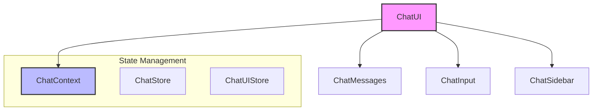

# Chat Components Module

## Module Overview

The Chat Components Module provides the user interface for AI-powered conversations in the Aide VSCode extension. It implements a flexible chat interface supporting multiple conversation modes (standard chat, composer, agent, etc.) with rich features like file attachments, code rendering, and web previews.

## Core Functionality

- **Multi-Modal Chat Interface**: Renders conversations with support for text, code, images, and interactive elements
- **Context Management**: Maintains conversation state and history across sessions
- **Message Rendering**: Displays AI and user messages with rich formatting and syntax highlighting
- **Input Handling**: Provides editor capabilities with file attachments and @mentions
- **Web Preview Integration**: Embeds web application previews for v1 mode
- **Session Management**: Enables browsing and switching between different chat sessions

## Key Components

### Directory Structure

```
chat/
├── chat-ui.tsx              # Main chat interface component
├── editor/                  # Input editor components
├── messages/                # Message rendering components
├── selectors/               # UI selectors (files, models, mentions)
├── sidebar/                 # Chat session navigation
└── web-preview/             # Web application preview components
```

### Main Components

- **chat-ui.tsx**: Orchestrates the entire chat interface with messages, input area, and sidebar
- **editor/**: Components for composing messages with rich editing capabilities
- **messages/**: Components for rendering different message types and conversation history
- **selectors/**: UI components for selecting files, models, and other resources
- **sidebar/**: Navigation components for browsing and managing chat sessions
- **web-preview/**: Components for rendering web application previews

## Dependencies

The Chat Components Module integrates with several core systems:

- **Chat Context System**: Provides conversation state and persistence
- **Entity System**: Defines core data structures for conversations
- **Network Layer**: Handles communication with the extension backend
- **UI Component Library**: Provides foundational UI elements
- **Lexical Editor**: Powers the rich text editing experience

## Usage Examples

```tsx
// Basic usage of the ChatUI component
import { ChatUI } from '@webview/components/chat/chat-ui'
import { ChatContextProvider } from '@webview/contexts/chat-context'

const ChatView: React.FC = () => {
  return (
    <ChatContextProvider>
      <ChatUI />
    </ChatContextProvider>
  )
}
```

## Architecture Notes

The Chat Components Module follows a component-based architecture with React contexts for state management:



The system follows these key design principles:

1. **Component Composition**: UI built from focused components
2. **Context-Based State Management**: React contexts provide state access
3. **Store Pattern**: Zustand stores manage complex state
4. **Separation of Concerns**: Clear boundaries between UI and logic

This architecture provides a flexible foundation for building rich chat experiences within the VSCode extension, enabling seamless communication between users and AI assistants.
