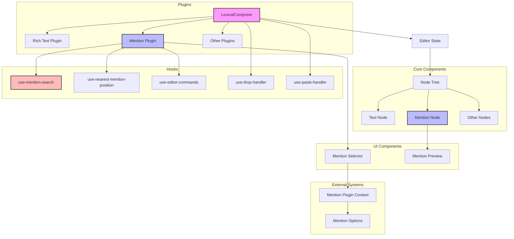

# Lexical Editor Module

## Module Overview

The Lexical Editor Module provides a rich text editing framework for the Aide VSCode extension, built on Meta's Lexical editor. It implements a customized editing experience with specialized features like @mentions, file attachments, and code formatting, enabling seamless content creation for AI conversations while maintaining a lightweight and extensible architecture.

## Core Functionality

- **Rich Text Editing**: Provides a full-featured text editor with support for formatting, mentions, and custom nodes
- **@Mention Integration**: Enables referencing files, code snippets, and other resources directly in the editor
- **Custom Node System**: Extends Lexical's node architecture with specialized nodes for Aide's unique requirements
- **Plugin Architecture**: Implements a modular plugin system for extending editor capabilities
- **Event Handling**: Manages keyboard events, paste operations, and drag-and-drop interactions
- **Theme Customization**: Supports custom theming to match the VSCode environment

## Key Components

### Core Nodes

- **mention-node.tsx**: Custom Lexical node implementation for @mentions
  - Defines the MentionNode class that extends Lexical's DecoratorNode
  - Handles serialization and deserialization of mention data
  - Provides custom rendering for mentions with preview functionality
  - Implements proper keyboard navigation and selection behavior
  - Manages mention data structure and text representation

### Plugins

- **mention-plugin.tsx**: Plugin that enables @mention functionality

  - Integrates with the mention selector UI components
  - Handles mention search and selection
  - Manages the mention popup positioning and visibility
  - Inserts mention nodes into the editor when selected
  - Provides keyboard navigation for the mention selector

- **tree-view-debug-plugin.tsx**: Development tool for debugging editor state
  - Renders a visual representation of the editor's node tree
  - Helps developers understand the structure of complex documents
  - Useful for debugging custom node implementations

### Hooks

- **use-mention-search.ts**: Hook for handling mention search functionality

  - Tracks the current search query as the user types
  - Detects when a user is attempting to create a mention
  - Manages the mention selector's open/closed state
  - Provides utilities for clearing mention input

- **use-nearest-mention-position.ts**: Hook for positioning the mention selector

  - Calculates the optimal position for the mention dropdown
  - Ensures the selector appears near the cursor position
  - Handles viewport boundaries to prevent overflow
  - Updates position as the cursor moves

- **use-editor-commands.ts**: Hook for handling editor keyboard commands

  - Registers custom keyboard shortcuts
  - Manages command execution and event handling
  - Provides a consistent interface for editor operations

- **use-drop-handler.ts**: Hook for handling drag and drop operations

  - Enables dropping files and other content into the editor
  - Converts dropped content into appropriate editor nodes
  - Handles permissions and validation for dropped content

- **use-paste-handler.ts**: Hook for customizing paste behavior
  - Intercepts paste events to handle special content types
  - Transforms pasted content into appropriate editor nodes
  - Preserves formatting when pasting from various sources
  - Handles code blocks, links, and other specialized content

### Themes

- **normal.css**: CSS styles for the editor's default theme

  - Defines the visual appearance of editor elements
  - Handles spacing, colors, and typography
  - Provides styles for different node types and states

- **normal.ts**: TypeScript theme configuration
  - Defines the theme structure for Lexical
  - Maps CSS classes to editor elements and nodes
  - Configures editor behavior based on theme settings

## Dependencies

The Lexical Editor Module has the following key dependencies:

- **Lexical**: Core editor framework from Meta

  - Provides the foundation for the rich text editing experience
  - Offers a node-based document model
  - Handles selection, history, and core editing operations

- **React**: UI library for rendering editor components

  - Integrates with Lexical through the @lexical/react package
  - Provides component lifecycle management
  - Enables declarative UI development

- **Shared Entities**: Common types and interfaces

  - Defines the Mention type used across the application
  - Provides consistent data structures for editor content

- **UI Components**: Reusable UI elements
  - Popover components for mention previews
  - Selector components for mention options
  - Button and input components for editor controls

## Usage Examples

```tsx
// Example of setting up a Lexical editor with mention support
import { LexicalComposer } from '@lexical/react/LexicalComposer'
import { ContentEditable } from '@lexical/react/LexicalContentEditable'
import { RichTextPlugin } from '@lexical/react/LexicalRichTextPlugin'
import { MentionNode } from '@webview/lexical/nodes/mention-node'
import { MentionPlugin } from '@webview/lexical/plugins/mention-plugin'
import { normalTheme } from '@webview/lexical/themes/normal'

const ChatEditor: React.FC = () => {
  const initialConfig = {
    namespace: 'ChatEditor',
    theme: normalTheme,
    nodes: [MentionNode],
    onError: (error: Error) => console.error(error)
  }

  return (
    <LexicalComposer initialConfig={initialConfig}>
      <div className="editor-container">
        <RichTextPlugin
          contentEditable={<ContentEditable className="editor-input" />}
          placeholder={
            <div className="editor-placeholder">Type a message...</div>
          }
        />
        <MentionPlugin />
      </div>
    </LexicalComposer>
  )
}
```

```tsx
// Example of programmatically inserting a mention
import { useLexicalComposerContext } from '@lexical/react/LexicalComposerContext'
import { $createMentionNode } from '@webview/lexical/nodes/mention-node'
import { $getSelection, $isRangeSelection } from 'lexical'

const InsertMentionButton: React.FC = () => {
  const [editor] = useLexicalComposerContext()

  const handleInsertMention = () => {
    editor.update(() => {
      const selection = $getSelection()

      if ($isRangeSelection(selection)) {
        const mention = {
          type: 'file',
          data: { path: '/path/to/file.ts' }
        }

        const mentionNode = $createMentionNode(mention, '@file.ts')
        selection.insertNodes([mentionNode])
      }
    })
  }

  return <button onClick={handleInsertMention}>Insert File Mention</button>
}
```

## Architecture Notes

The Lexical Editor Module follows a component-based architecture with clear separation of concerns:



The system follows these key design principles:

1. **Node-Based Document Model**: Content is represented as a tree of specialized nodes
2. **Plugin Architecture**: Editor functionality is extended through plugins
3. **React Integration**: UI components are built with React for declarative rendering
4. **Custom Nodes**: Specialized node types handle unique content requirements
5. **Hook-Based Logic**: Editor behavior is encapsulated in custom React hooks
6. **Immutable Updates**: All state changes follow Lexical's immutable update pattern

The data flow typically follows these steps:

1. User interacts with the editor (typing, pasting, dropping content)
2. Editor plugins intercept and process these interactions
3. Custom hooks apply specialized logic (e.g., mention detection)
4. Editor state is updated through Lexical's transaction system
5. Custom nodes render their content based on the updated state
6. UI components reflect the changes in the document

This architecture provides a flexible and maintainable foundation for rich text editing in the Aide VSCode extension, enabling seamless content creation for AI conversations while maintaining extensibility for future enhancements.
