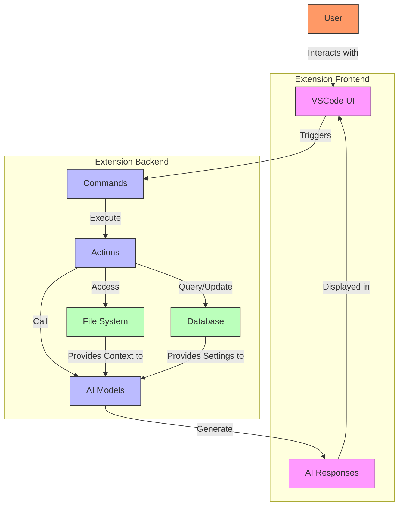
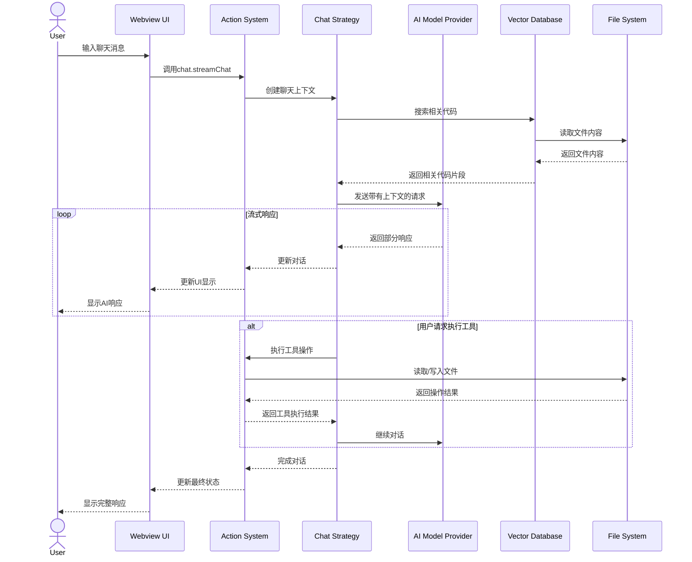
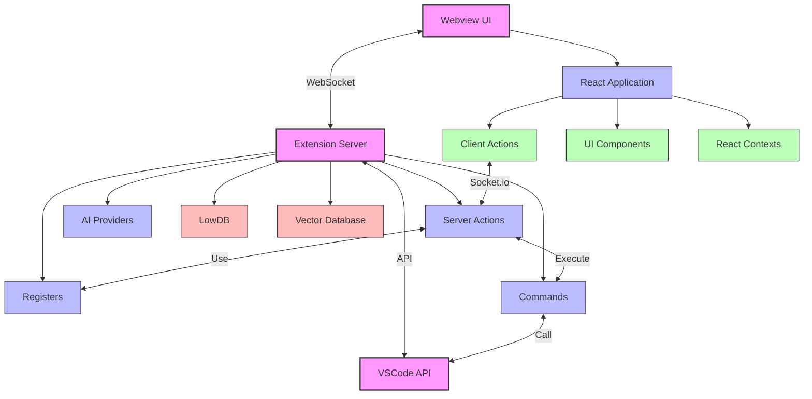

# Aide VSCode Extension 架构图

## 项目整体架构

以下图表展示了Aide VSCode扩展的整体架构，包括所有主要模块及其关系。

```mermaid
graph TD
    %% Main Extension Structure
    Extension[Aide VSCode Extension] --> ExtensionCore[Extension Core]
    Extension --> WebviewUI[Webview UI]

    %% Extension Core Components
    ExtensionCore --> RegisterSystem[Register System]
    ExtensionCore --> CommandSystem[Command System]
    ExtensionCore --> ActionSystem[Action System]
    ExtensionCore --> AISystem[AI System]
    ExtensionCore --> ChatSystem[Chat System]
    ExtensionCore --> FileSystem[File System]
    ExtensionCore --> DBSystem[Database System]

    %% Register System
    RegisterSystem --> BaseRegister[Base Register]
    BaseRegister --> WebviewRegister[Webview Register]
    BaseRegister --> CodeEditRegister[Code Edit Register]
    BaseRegister --> WorkspaceCheckpointRegister[Workspace Checkpoint Register]
    BaseRegister --> McpRegister[MCP Register]
    BaseRegister --> WebVMRegister[WebVM Register]
    BaseRegister --> ChatHistoriesTreeRegister[Chat Histories Tree Register]
    BaseRegister --> PromptSnippetTreeRegister[Prompt Snippet Tree Register]
    BaseRegister --> ActionRegister[Action Register]
    BaseRegister --> ServerPluginRegister[Server Plugin Register]
    BaseRegister --> TerminalWatcherRegister[Terminal Watcher Register]
    BaseRegister --> DBRegister[DB Register]
    BaseRegister --> ModelRegister[Model Register]
    BaseRegister --> CodebaseWatcherRegister[Codebase Watcher Register]
    BaseRegister --> TmpFileRegisters[Temporary File Registers]

    %% Command System
    CommandSystem --> BaseCommand[Base Command]
    BaseCommand --> UserFacingCommands[User-Facing Commands]
    BaseCommand --> PrivateCommands[Private Commands]
    UserFacingCommands --> ActionCommand[Action Command]
    UserFacingCommands --> BatchProcessorCommand[Batch Processor Command]
    UserFacingCommands --> CodeConvertCommand[Code Convert Command]
    UserFacingCommands --> RenameVariableCommand[Rename Variable Command]
    UserFacingCommands --> SmartPasteCommand[Smart Paste Command]
    PrivateCommands --> CopyFileTextCommand[Copy File Text Command]
    PrivateCommands --> OpenWebviewCommand[Open Webview Command]
    PrivateCommands --> ReplaceFileCommand[Replace File Command]

    %% Action System
    ActionSystem --> ServerActionCollection[Server Action Collection]
    ActionSystem --> ClientActionCollection[Client Action Collection]
    ServerActionCollection --> AgentActionsCollection[Agent Actions Collection]
    ServerActionCollection --> AIModelActionsCollection[AI Model Actions Collection]
    ServerActionCollection --> ChatActionsCollection[Chat Actions Collection]
    ServerActionCollection --> FileActionsCollection[File Actions Collection]
    ServerActionCollection --> CodebaseActionsCollection[Codebase Actions Collection]
    ServerActionCollection --> GitActionsCollection[Git Actions Collection]
    ServerActionCollection --> SettingsActionsCollection[Settings Actions Collection]
    ServerActionCollection --> SystemActionsCollection[System Actions Collection]

    %% AI System
    AISystem --> ModelProviders[Model Providers]
    AISystem --> Embeddings[Embeddings]
    ModelProviders --> ModelProviderFactory[Provider Factory]
    ModelProviders --> BaseProviderFunctionality[Base Provider Functionality]
    ModelProviders --> OpenAIProvider[OpenAI Provider]
    ModelProviders --> AnthropicProvider[Anthropic Provider]
    ModelProviders --> AzureOpenAIProvider[Azure OpenAI Provider]
    Embeddings --> EmbeddingManager[Embedding Manager]
    EmbeddingManager --> LocalEmbeddings[Local Embeddings]
    EmbeddingManager --> RemoteEmbeddings[Remote Embeddings]

    %% Chat System
    ChatSystem --> ChatStrategies[Chat Strategies]
    ChatSystem --> VectorDB[Vector Database]
    ChatStrategies --> BaseStrategy[Base Strategy]
    BaseStrategy --> ChatStrategy[Chat Strategy]
    BaseStrategy --> ComposerStrategy[Composer Strategy]
    BaseStrategy --> V1Strategy[V1 Strategy]
    BaseStrategy --> NoPromptStrategy[No Prompt Strategy]
    BaseStrategy --> AgentStrategy[Agent Strategy]
    VectorDB --> BasePGVectorIndexer[Base PG Vector Indexer]
    BasePGVectorIndexer --> CodebaseIndexer[Codebase Indexer]
    BasePGVectorIndexer --> DocIndexer[Documentation Indexer]

    %% File System
    FileSystem --> VirtualFileSystem[Virtual File System]
    VirtualFileSystem --> SchemeHandlers[Scheme Handlers]
    VirtualFileSystem --> VSCodeFS[VSCode FS]
    SchemeHandlers --> WorkspaceSchemeHandler[Workspace Scheme Handler]
    SchemeHandlers --> ProjectSchemeHandler[Project Scheme Handler]
    SchemeHandlers --> DocSchemeHandler[Doc Scheme Handler]
    SchemeHandlers --> GitProjectSchemeHandler[Git Project Scheme Handler]
    SchemeHandlers --> WebVMSchemeHandler[WebVM Scheme Handler]

    %% Database System
    DBSystem --> BaseDB[Base DB]
    BaseDB --> AIModelDB[AI Model DB]
    BaseDB --> AIProviderDB[AI Provider DB]
    BaseDB --> ChatSessionsDB[Chat Sessions DB]
    BaseDB --> DocSitesDB[Doc Sites DB]
    BaseDB --> GitProjectDB[Git Project DB]
    BaseDB --> PromptSnippetsDB[Prompt Snippets DB]
    BaseDB --> SettingsDB[Settings DB]

    %% MCP Register Detail
    McpRegister --> McpConnectionManager[MCP Connection Manager]
    McpRegister --> McpResourceManager[MCP Resource Manager]
    McpConnectionManager --> McpConnection[MCP Connection]
    McpResourceManager --> ResourceCache[Resource Cache]

    %% Webview UI Components
    WebviewUI --> ChatComponents[Chat Components]
    WebviewUI --> CodeEditComponents[Code Edit Components]
    WebviewUI --> WebVMComponents[WebVM Components]
    WebviewUI --> SettingsComponents[Settings Components]

    %% Chat Components Detail
    ChatComponents --> ChatUI[Chat UI]
    ChatUI --> ChatMessages[Chat Messages]
    ChatUI --> ChatInput[Chat Input]
    ChatUI --> ChatSidebar[Chat Sidebar]
    ChatUI --> WebPreview[Web Preview]

    %% Entity System (Shared)
    SharedEntities[Shared Entities] --> BaseEntity[Base Entity]
    BaseEntity --> AIProviderEntity[AI Provider Entity]
    BaseEntity --> AIModelEntity[AI Model Entity]
    BaseEntity --> ChatContextEntity[Chat Context Entity]
    BaseEntity --> ChatSessionEntity[Chat Session Entity]
    BaseEntity --> ConversationEntity[Conversation Entity]
    BaseEntity --> ProjectEntity[Project Entity]
    BaseEntity --> SettingEntity[Setting Entity]

    %% Cross-Component Relationships
    ActionSystem --> RegisterSystem
    CommandSystem --> RegisterSystem
    ChatSystem --> AISystem
    VectorDB --> Embeddings
    ChatStrategies --> ModelProviders
    ServerActionCollection --> BaseDB
    ClientActionCollection --> WebviewUI

    %% Style Definitions
    classDef core fill:#f9f,stroke:#333,stroke-width:2px
    classDef major fill:#bbf,stroke:#333,stroke-width:2px
    classDef component fill:#bfb,stroke:#333,stroke-width:1px
    classDef ui fill:#fbb,stroke:#333,stroke-width:1px

    class Extension,ExtensionCore,WebviewUI core
    class RegisterSystem,CommandSystem,ActionSystem,AISystem,ChatSystem,FileSystem,DBSystem major
    class BaseRegister,BaseCommand,ServerActionCollection,ClientActionCollection,ModelProviders,ChatStrategies,VirtualFileSystem,BaseDB component
    class ChatComponents,CodeEditComponents,WebVMComponents,SettingsComponents ui
```

## 核心组件类图

以下类图展示了主要组件之间的继承和实现关系：

```mermaid
classDiagram
    %% Register System
    class BaseRegister {
        <<abstract>>
        #context: ExtensionContext
        #registerManager: RegisterManager
        #commandManager: CommandManager
        +register() void|Promise~void~
        +dispose() void|Promise~void~
    }

    class RegisterManager {
        -registers: Map~string, BaseRegister~
        +setupRegister(RegisterClass)
        +getRegister~T~(RegisterClass) T|undefined
        +dispose()
    }

    class FeatureRegister {
        -disposables: Disposable[]
        +register()
        +dispose()
    }

    BaseRegister <|-- FeatureRegister
    RegisterManager --> BaseRegister : manages

    %% Command System
    class BaseCommand {
        <<abstract>>
        #context: ExtensionContext
        #commandManager: CommandManager
        +commandName: string
        +register()
        +run(...args)
        +dispose()
    }

    class CommandManager {
        +registerCommand()
        +executeCommand()
        +registerService()
        +getService()
    }

    CommandManager --> BaseCommand : manages

    %% Action System
    class ServerActionCollection {
        <<abstract>>
        +categoryName: string
        +registerManager: RegisterManager
        +commandManager: CommandManager
    }

    class ClientActionCollection {
        <<abstract>>
        +categoryName: string
    }

    %% Entity System
    class BaseEntity~T~ {
        <<abstract>>
        +T entity
        +constructor(t, override?)
        #getDefaults(t, override?)*
    }

    class IBaseEntity {
        <<interface>>
        +string id
        +number? schemaVersion
    }

    BaseEntity --|> IBaseEntity : implements via T

    %% Chat Strategy System
    class BaseStrategy {
        <<abstract>>
        #registerManager: RegisterManager
        #commandManager: CommandManager
        +getAnswers(chatContext)
        +convertToPrompt(type, chatContext)
    }

    class ChatStrategy {
        +register()
        +getAnswers(chatContext)
        +convertToPrompt(type, chatContext)
    }

    class ComposerStrategy {
        +register()
        +getAnswers(chatContext)
        +convertToPrompt(type, chatContext)
    }

    class V1Strategy {
        +register()
        +getAnswers(chatContext)
        +convertToPrompt(type, chatContext)
    }

    class NoPromptStrategy {
        +register()
        +getAnswers(chatContext)
        +convertToPrompt(type, chatContext)
    }

    %% Database System
    class BaseDB~T~ {
        <<abstract>>
        -Low db
        -number currentVersion
        +getAll() T[]
        +add(item) T
        +remove(id)
        +update(id, updates) T
        #migrateData()
        #abstract getDefaults() Partial~T~
        #abstract init()
    }

    %% File System
    class BaseSchemeHandler {
        <<abstract>>
        +scheme: UriScheme
        +resolveBaseUriSync(uri)
        +resolveBaseUriAsync(uri)
        +resolveBasePathSync(uri)
        +resolveBasePathAsync(uri)
        +resolveRelativePathSync(uri)
        +resolveRelativePathAsync(uri)
        +resolveFullPathSync(uri)
        +resolveFullPathAsync(uri)
        +createSchemeUri(props)
    }

    class VirtualFileSystem {
        -schemeHandlers: Map~UriScheme, BaseSchemeHandler~
        +registerSchemeHandler(handler)
        +readFilePro(uri)
        +writeFilePro(uri, data)
        +resolveFullPathProAsync(uri)
    }

    VirtualFileSystem --> BaseSchemeHandler : uses
```

## 数据流图

以下图表展示了Aide VSCode扩展中的主要数据流：

## 典型用户交互序列图

以下序列图展示了用户与Aide VSCode扩展进行聊天交互的典型流程：

## 组件交互图

以下图表展示了Aide VSCode扩展中主要模块之间的通信方式：

## 模块职责说明

| 模块名称        | 主要职责                             |
| --------------- | ------------------------------------ |
| Register System | 管理扩展组件的注册、初始化和生命周期 |
| Command System  | 处理VSCode命令的注册和执行           |
| Action System   | 提供服务器和客户端之间的API层        |
| AI System       | 集成各种AI服务和模型                 |
| Chat System     | 实现AI对话工作流和策略               |
| File System     | 提供统一的文件访问抽象层             |
| Database System | 管理应用数据的持久化存储             |
| Webview UI      | 实现用户界面和交互体验               |
| Entity System   | 定义核心领域对象和数据模型           |
| Vector Database | 提供代码和文档的语义搜索能力         |
| MCP Register    | 集成Model Context Protocol功能       |
| WebVM Register  | 提供Web应用开发和预览环境            |
